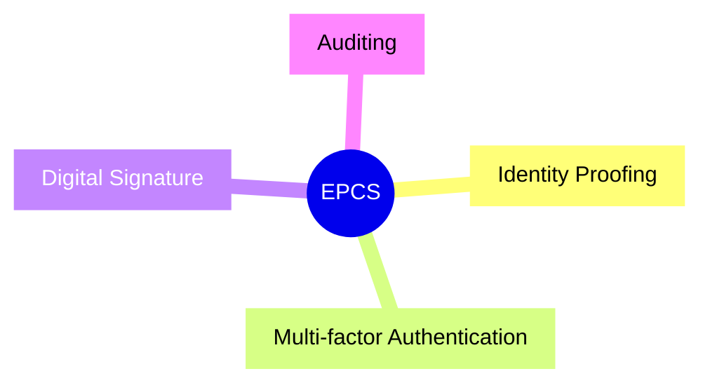

# Engineering software modules for EPCS (Electronic Prescription of Controlled Substances)

On October 26, 2017, the U.S. Department of Health and Human Services declared that the opioid crisis was a public health emergency.([Reference](https://aspr.hhs.gov/legal/PHE/Pages/opioids.aspx))  The Center for Disease Control and Prevention traces the first wave of prescription opioid drug overdoses back to at least 1999.([Reference](https://www.cdc.gov/opioids/basics/epidemic.html))  Sometime around 2010, the U.S. government, both state and federal levels, started taking actions to address the opioid crisis, and in this time period, the Drug Enforcement Agency (DEA) proposed EPCS as a way to help combat opioid overprescription.([21 CFR 1300.03](https://www.ecfr.gov/current/title-21/chapter-II/part-1300/section-1300.03))  To have a better understanding of the opioid crisis, watch Netflix's *[The Pharmacist](https://www.netflix.com/title/81002576)*.

# Four Fundamentals of EPCS

1.  Identity Proofing
1.  Multi-factor Authentication
1.  Digital Signature
1.  Auditing

# Identity Proofing

The latest revision of EPCS codification, [21 CFR 1311](https://www.ecfr.gov/current/title-21/chapter-II/part-1311), references *Electronic Authentication Guideline* (or [NIST SP 800–63–1](https://nvlpubs.nist.gov/nistpubs/Legacy/SP/nistspecialpublication800-63-1.pdf)) to describe the requirements around identity proofing.  In a nutshell, it mandates the use of trusted entities that can verify a registered human user (whose enrollment may involve a process like a face-to-face interview) and that can also operate special security token services known as credential service provider (CSP) that can issue security tokens for the human user that have claims pertaining to the level of assurance of the user's digital identity, which are issued in varying levels and types (like IAL and LOA).  Identity proofing solves the problem of impostors crafting fraudulent prescriptions for additive yet legal substances, which are then sold through illicit channels and are used for non-medicinal purposes.  To be able to prescribe medicine would require the person to be registered with the DEA.  This registration is a necessity for the electronic presciption as part of the identity proofing process.

# Multi-factor Authentication

[21 CFR 1311](https://www.ecfr.gov/current/title-21/chapter-II/part-1311) requires that a practitioner prescribing electronically must authenticate with the EPCS software using an authentication protocol that uses **two** of the three factors:

-  Something only the practitioner knows, such as a password or response to a challenge question.
-  Something the practitioner has, a device (hard token) separate from the computer to which the practitioner is gaining access.
-  Something the practitioner is, biometric data such as a fingerprint or iris scan.

Most CSP vendors fulfill this requirement by complementing the username/password (first factor) authentication with an OTP (one-time password) token authentication (second factor).  Some CSP vendors even fingerprint reader capabilities for biometric authentication.

# Digital Signature

# Auditing

# 