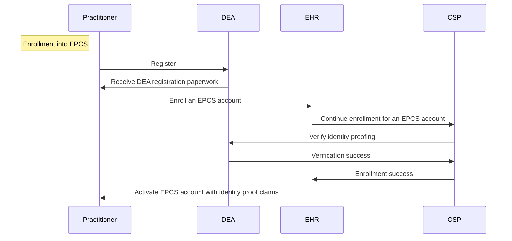
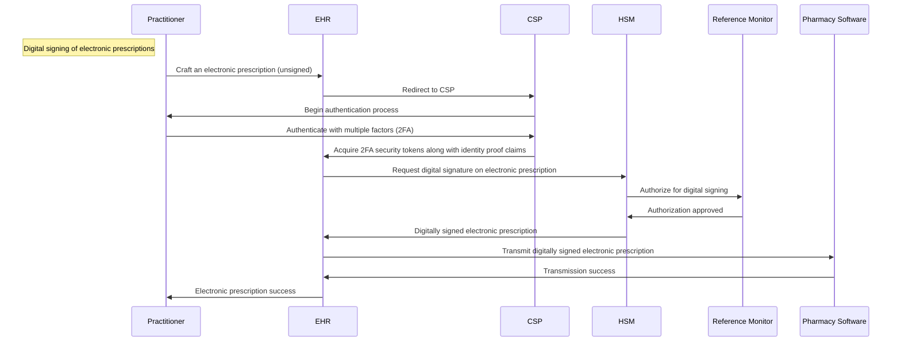

# Engineering software modules for EPCS (Electronic Prescription of Controlled Substances)

On October 26, 2017, the U.S. Department of Health and Human Services declared that the opioid crisis was a public health emergency.([Reference](https://aspr.hhs.gov/legal/PHE/Pages/opioids.aspx))  The Center for Disease Control and Prevention traces the first wave of prescription opioid drug overdoses back to at least 1999.([Reference](https://www.cdc.gov/opioids/basics/epidemic.html))  Sometime around 2010, the U.S. government, both state and federal levels, started taking actions to address the opioid crisis, and in this time period, the Drug Enforcement Agency (DEA) proposed EPCS as a way to help combat opioid overprescription.([21 CFR 1300.03](https://www.ecfr.gov/current/title-21/chapter-II/part-1300/section-1300.03))  To have a better understanding of the opioid crisis, watch Netflix's *[The Pharmacist](https://www.netflix.com/title/81002576)*.

# Four Fundamentals of EPCS

Generally speaking, electronic healthcare record (EHR) software in the market typically already has a database of medicinal drugs and can craft scripts of prescription medicine with precise dosage so there is generally no need to worry about generating prescription documents when developing EPCS applications.  When developing EPCS modules for EHR applications, there are four fundamental functions to be mindful of.

1.  Identity Proofing
1.  Multi-factor Authentication
1.  Digital Signature
1.  Auditing

# Identity Proofing

The latest revision of EPCS codification, [21 CFR 1311](https://www.ecfr.gov/current/title-21/chapter-II/part-1311), references *Electronic Authentication Guideline* (or [NIST SP 800–63–1](https://nvlpubs.nist.gov/nistpubs/Legacy/SP/nistspecialpublication800-63-1.pdf), which is as of this writing is superseded by *Digital Identity Guidelines* or [NIST SP 800–63–3](https://pages.nist.gov/800-63-3/sp800-63-3.html)) to describe the requirements around identity proofing.  In a nutshell, it mandates the use of trusted entities that can verify a registered human user (whose enrollment may involve a process like a face-to-face interview) and that can also operate special security token services known as credential service provider (CSP) that can issue security tokens for the human user that have claims pertaining to the level of assurance of the user's digital identity, which are issued in varying levels and types (like IAL and LOA).  Identity proofing solves the problem of impostors crafting fraudulent prescriptions for additive yet legal substances, which are then sold through illicit channels and are used for non-medicinal purposes.  To be able to prescribe medicine would require the person to be registered with the DEA.  This registration is a necessity for the electronic prescription as part of the identity proofing process.

# Multi-factor Authentication

[21 CFR 1311](https://www.ecfr.gov/current/title-21/chapter-II/part-1311) requires that a practitioner prescribing electronically must authenticate with the EPCS software using an authentication protocol that uses **two** of the three factors:

-  Something only the practitioner knows, such as a password or response to a challenge question.
-  Something the practitioner has, a device (hard token) separate from the computer to which the practitioner is gaining access.
-  Something the practitioner is, biometric data such as a fingerprint or iris scan.

Most CSP vendors fulfill this requirement by complementing the username/password (first factor) authentication with an OTP (one-time password) token authentication (second factor).  Some CSP vendors even fingerprint reader capabilities for biometric authentication.  This requirement may also be referred to as the two-factor authentication (2FA).  This requirement strengthens the security around weak or vulnerable credential practices (like re-used passwords or dictionary passwords).

# Digital Signature

An EPCS application must be configured to have proper PKI (public-key infrastructure) setup and hardware security modules (HSM) in order to digitally sign electronic prescriptions.  The HSMs are cryptographic devices that are validated against the US federal standard outlined in [FIPS 140-2](https://nvlpubs.nist.gov/nistpubs/FIPS/NIST.FIPS.140-2.pdf).  The HSMs protect the digital signing keys used to digitally sign the electronic prescriptions.  This function adds tamper-protection to the electronic prescription in order to deter adversary-in-the-middle attackers from intercepting the electronic prescription with the intention of modifying the script for illicit or non-medicinal purposes.  Of course, digitally signatures are meaningless if they are not validated.  A pharmacy tech at pharmacies like Walgreens or CVS should be using EPCS compliant software that validates digitally signed electronic prescription as stated in [21 CFR 1311](https://www.ecfr.gov/current/title-21/chapter-II/part-1311).

Learn more about reference monitor [here](https://csrc.nist.gov/glossary/term/reference_monitor).

# Auditing

Record tracking of specific events pertaining to the authentication and digital signing activities are required as stated in [21 CFR 1311](https://www.ecfr.gov/current/title-21/chapter-II/part-1311).  These records must be kept for at least two years.  Also, certain audit events are tracked as "incidents" that must be reported on daily basis. [Reference](https://www.ecfr.gov/current/title-21/part-1311#p-1311.215(b))  In the event that a practitioner has to be investigated for overprescription or fraudulent prescriptions, the audit trails will come in handy once for the DEA.
