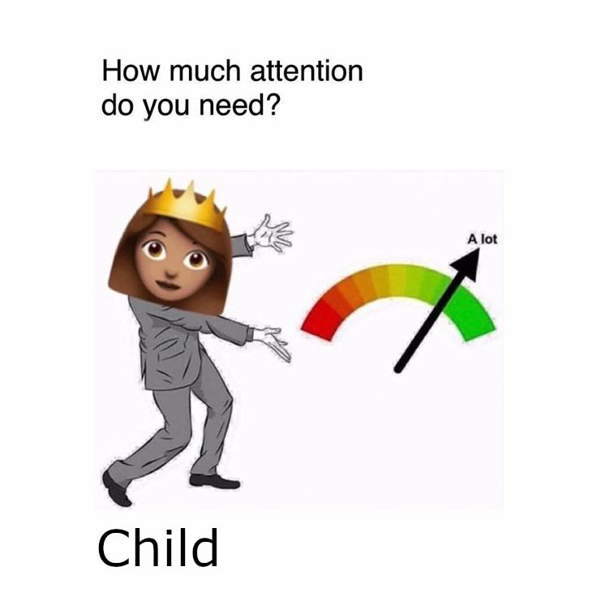

# What I learned in foster parent school is...

*Disclaimer: All images in this work are not our work.  Copyright belongs to all respectful owners.*

- Cycle of Needs
- Maslows Hierarchy of Needs
- Erikson's Stages of Development
- Trauma-informed Parenting

# Cycle of Needs

1.  Need (Underlying Condition)
1.  Expression
1.  Intervention
1.  Relaxation

## Need (Underlying Condition)

## Expression

## Intervention

## Relaxation

## Attachment

It's important for parents/guardians to address their children's cycles of needs in order for the child to form an attachment with the parents/guardiants.

## Self-regulation

As the child ages and matures, self-regulation occurs.

## Maslow's Theory of Human Motivation

Per Maslow's theory, human basic needs can be modelled as being stacked in a pyramid.  See Maslow's original paper on his theory of human motivation [here](https://psychclassics.yorku.ca/Maslow/motivation.htm).

1.  Physiological Needs
1.  Safety Needs
1.  Love Needs
1.  Esteem Needs
1.  Self-actualization Needs

### Self-actualization

To quote Maslow:
> The need for self-actualization. -- Even if all these needs are satisfied, we may still often (if not always) expect that a new discontent and restlessness will soon develop, unless the individual is doing what he is fitted for. A musician must make music, an artist must paint, a poet must write, if he is to be ultimately happy. What a man can be, he must be. This need we may call self-actualization.

**Paraphrase**: Tapping into your full potential.  Bringing your best game in life.  Being in tuned with your real (and arguably better) version of yourself.

# Erikson's Stages of Development
| Stage | Psychosocial Crisis | Basic Virtue | Age |
| :-- | :-- | :-- | :-- |
| 1 | Trust vs Mistrust | Hope | 0 - 1 |
| 2 | Autonomy vs Shame | Will | 1 - 2 |
| 3 | Initiative vs Guilt | Purpose | 2 - 6 |
| 4 | Industry vs Inferiority | Competence | 6 - 12 |
| 5 | Identity vs Role Confusion | Fidelity | 12 - 18 |

_Note: This is not the complete table of Erikson's Stages of Development.  Stages 6, 7, and 8 are omitted to focus on child development._

# Development Regression
Studies have shown that trauma can regress the development age of a person.

## Case Study: 10 yo in a 16 yo body

In this case study, Billy is a 16 year old male that grew up exposed to repeated cases of food insecurity, housing insecurity, neglect, maltreatment, and domestic violence.  Billy's development age is 10 years old.

| Stage | Psychosocial Crisis | Learned Virtue | Age |
| :-- | :-- | :-- | :-- |
| 1 | Trust vs Mistrust | Trust | 0 - 1 |
| 2 | Autonomy vs Shame | Autonomy | 1 - 2 |
| 3 | Initiative vs Guilt | Initiative | 2 - 6 |
| 4 | Industry vs Inferiority | **Inferiority** | 6 - 12 |
| 5 | Identity vs Role Confusion | **Role Confusion** | 12 - 18 |

**Inferiority**: Billy does not value hard work in comparison to his properly developed peers.  When it comes to chores, Billy does the bare minimum to do chores.  For example, Billy will only clean his room to avoid the threat of insect infestation in his room, but his room will still have weeks worth of dishes, food, and trash.  Billy will avoid schoolwork to the point of failing the classes.  Billy won't even ask for help with schoolwork because he knows tutoring takes too much of his time.

**Role Confusion**:  Billy does not participate in any activity in school or anything outside of the house.  Billy has played soccer, but that is because his foster parents and birth parents encouraged him.  Billy is looking for jobs to help in the house, but he only applied for jobs where his friends are working.  All of Billy's classmates are taking the ACT/SAT exams seriously, but Billy has showed no indication of taking college placement seriously.  As Erikson would put it, Billy is having an identity crisis and has no direction of what to do with his life despite being biologically a young adult.

# Trauma-informed Parenting

In conclusion, we learned that:

-  foster care involves being trauma-aware and helping foster children cope with trauma
-  foster care should be temporary and should facilitate co-parenting need to gratify the belonging needs of the foster child and birth parents
-  foster children are at high risk being developedly regressed and requires additional parenting energy compared to properly developed children