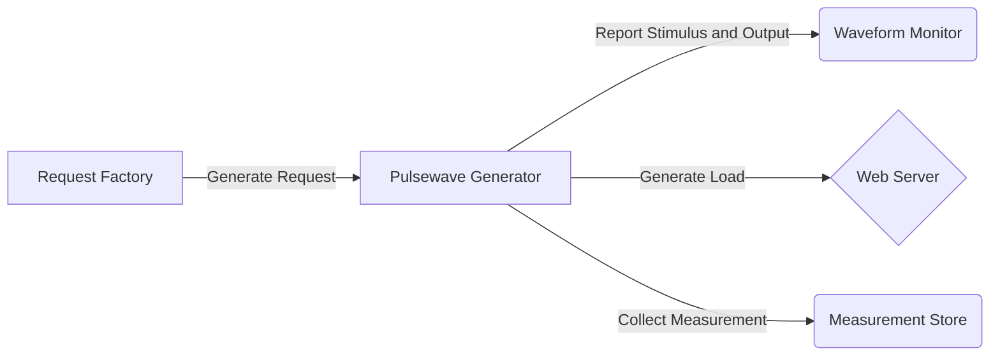
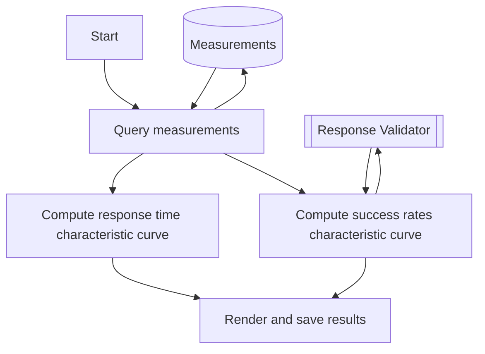

# Performance engineering web applications with load that is growing at a polynomial rate
Typically, a computer system's load grows as more user gain access to the system.  Eventually, a popular computer system will gain users at a fast rate (e.g. doubling every year) and will start to compound performance engineering issues.  The issues manifest itself as slower timing metrics (time-on-tasks, execution time, response time, first contentful paint, etc.), lower success rates in server requests and/or user interactions, and frequent failure modes.  In this lifecycle phase of the computer system, performance engineering must also scale up with the load.  I propose the following benchmark analyses:
  1. Web Server Benchmark
  1. Web Server Soak Test
  1. Webpage Benchmark
  1. User Interaction Benchmark
If there are observation and telemetry tools setup in production, there should be enough information on the operating range and states (warm vs cold) of the computer system.

# Web Server Benchmark
Measures response time and success rate

## How-To

Figure: Load generator infrastructure for web server benchmark

Figure: Computer program for web server benchmark results rendering
1.  First, build the load generator infrastructure as illustrated.  Ensure that the request factory has high throughput and low latency.  Ensure that the pulsewave generator has fast CPU, fast disk-writes, large memory, and high throughput.  More importantly, ensure the measured load generation is not off by no more than 50% from the rated load.  Also, the load generator only needs to report to the waveform monitor once every second for real-time viewing.  Lastly, the measurements are recorded (if configured) during load generation into the fast-writing disks, and then at the end of the load generation, the load generator stores all the measurements into the measurement store.  Make sure to have enough disk space.  The rule of thumb for disk space is: $$rated\_load * load\_test\_duration = disk\_space$$
Also, the disk should be fast within 3,000 IOPS or a little over to the rated load.
1.  Second, create the computer program for the web server benchmark results rendering.  The computer program must produce the following results:
    
    - Response Time Characteristic Curve for each desired percintiles in the form of $$y = mx + b$$ where $x$ is the load, and $y$ is the response time percentile.  If the $R^2$ is less thant 0.6, discard the results and rerun a new benchmark.
    - Success Rate Characteristice Curve in the form of $$ y =
     \left\{
        \begin{array}{ll}
            f & x>x_{Maximum Safe Load} \\
            1.0 & x<=x_{Maximum Safe Load} \\
        \end{array} 
    \right.  $$ where $f < 1.0$, $x$ is the load, and $y$ is the success rate as calculated by a response validator.  This line of best fit can be computed with linear regression.  This characteristic curve is essentially like a filter response of a low pass filter where the MSL (maximum safe load) is the cut-off frequency.  If the pass band is not continually at 100% success rate, discard the results and rerun the benchmark.
1.  Operate the load generator to apply 1-minute pulsewave towards the SUT (system-under-test) for at least 100 attack points throughout the operating range of the system (Lookup "one-in-ten" rule for predictive models).  However, before the pulsewaves are applied, apply a "warm-up load" to the SUT.  This load varies depending on the computer system as observed with SIP (system-in-production).  When in doubt, use a warm-up load of the highest rated load for a duration of 1 minute.  With that, there must be a cooldown duration between each pulsewave.  When in doubt, use a cooldown duration of 1 minute.
Make sure that the load applied is similar to the load applied to the SIP.  If the load in SIP hits multiple http endpoints simultaneously, then the load generator must hit multiple http endpoints simultaneaously.
1.  When the load generation is over and the measurements are collected, run the benchmark analysis computer program.

# Web Server Soak Test
//todo 

# Webpage Benchmark
//todo, FCP, LCP, FMP, TTI, TTFB, JSExecTime

# User Interaction Benchmark
//todo 

# Timing Metrics
Use of percentiles is preferred in measuring timing metrics with 50th, 95th, and 99th commonly used.  P50 is similar to the average of the timing metric, but conceptually they are not the same.  For extremely large populations (like the whole planet) or a population where laggards are expected, the 75th percentile is used and any larger percentile is ignored.  