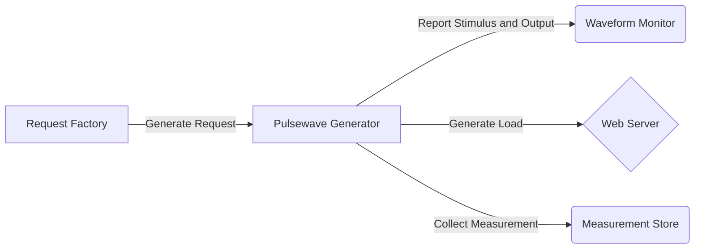
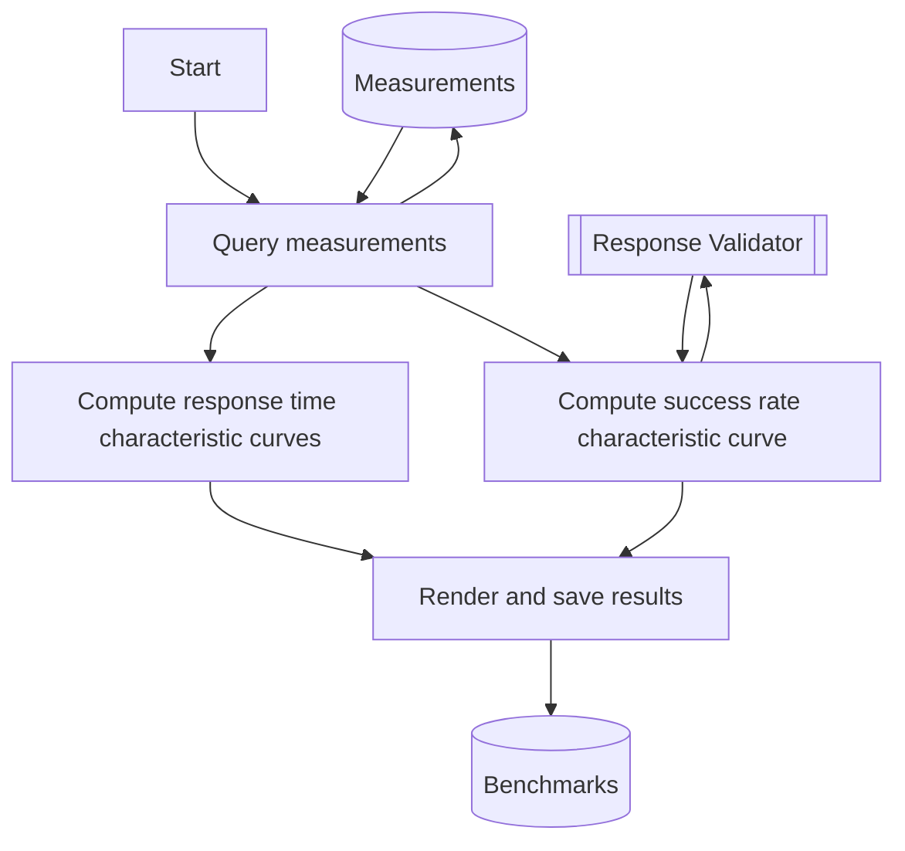
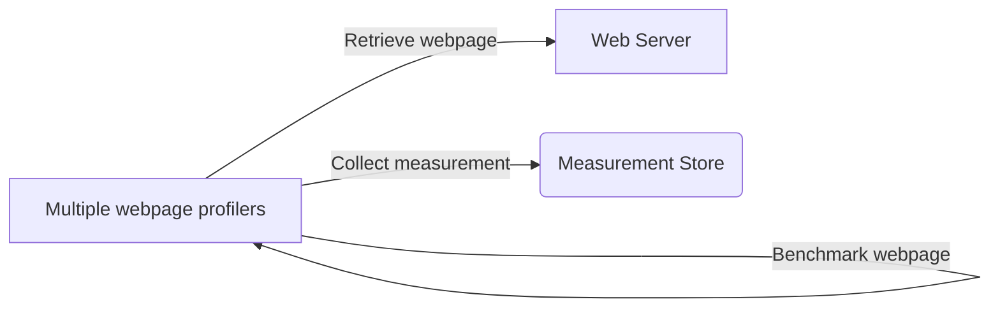
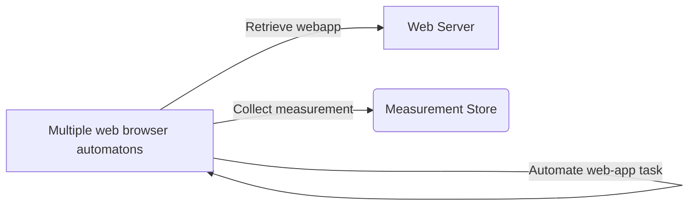
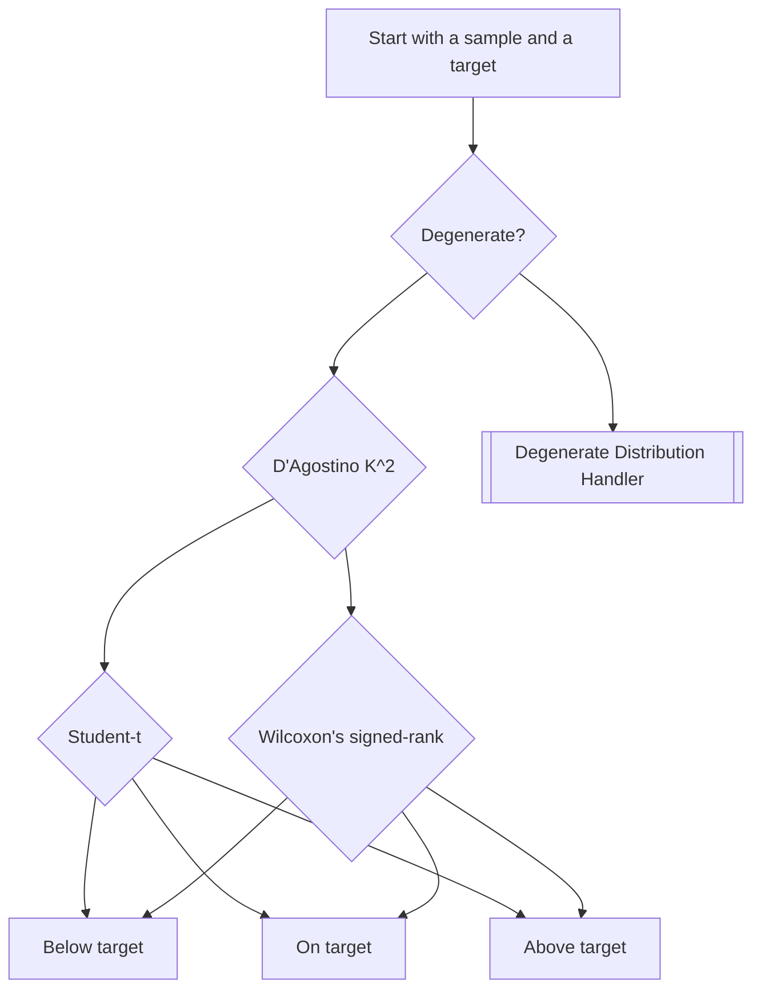
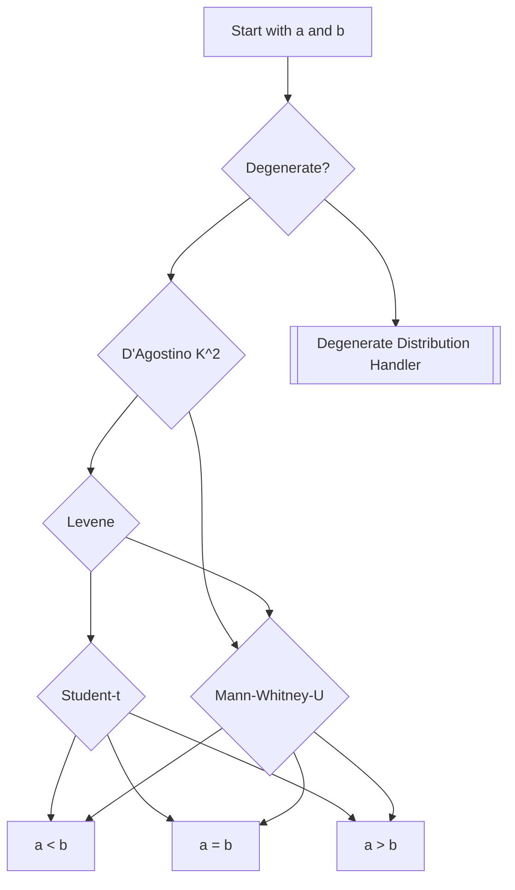

# Performance engineering web applications with load that is growing at a polynomial rate

Typically, a computer system's load grows as more users gain access to the system.  Eventually, a popular computer system will gain users at a fast rate (e.g. doubling every year) and will start to compound performance engineering issues.  The issues manifest itself as slower timing metrics (time-on-tasks, execution time, response time, first contentful paint, etc.), lower success rates in server requests and/or user interactions, and frequent failure modes.  In this lifecycle phase of the computer system, performance engineering must also scale up with the load.  In my experience, most product owners and technical leaders don't know how to formulate performance objectives for their computer systems.  The simplest benchmark I can think of is to maintain the current benchmark (timing metrics and success rates).  If there are observation and telemetry tools setup in production, there should be enough information on the operating range and states ("warm" states, "cold" states, data volume, etc.) of the computer system.  A benchmark's load generator infrastrucure should have "variabilization" that will explore the different possible state inputs for the load.  Also beware of reworking the computer system as they may introduce unavoidable performance degradations known as "performance deficits" that will require the vertical scaling or horizontal scaling of infrastructure to "payback the debt" in performance.  In addition, always check for memory leaks and CPU over-utilizations (and under-utilizations) with a soak test.

# Web Server Benchmark

Measures response time in milliseconds and success rate in percent.

## How-To

Figure: Load generator infrastructure for web server benchmarking

Figure: Computer program for web server benchmark results rendering

1.  First, build the load generator infrastructure as illustrated.  Commonly used software libraries for this are: Go's `vegeta`, Python's `locust`, Nodejs' `artillery`, and Java's `JMeter`.  Ensure that the request factory has high throughput, low latency, and more importantly variabilization that mirrors requests as seens in SIP  (system-in-production).  Ensure that the pulsewave generator has fast CPU, fast disk-writes, large memory, and high throughput.  More importantly, ensure the measured load generation is not off by no more than 50% from the rated load.  Also, the load generator only needs to report to the waveform monitor once every second for real-time viewing.  Lastly, the measurements are recorded (if configured) during load generation into the fast-writing disks, and then at the end of the load generation, the load generator stores all the measurements into the measurement store.  Make sure to have enough disk space.  The rule of thumb for disk space is:
    $$
    lt = d
    $$
    where $l$ is rated load, $t$ is the benchmark duration, and $d$ is the disk space.
    Also, the disk should be fast within 3,000 IOPS on average or the average IOPS is at least three times the rated load.

1.  Second, create the computer program for the web server benchmark results rendering.  The computer program must produce the following results:
    *   Response Time Characteristic Curve for each desired percintiles in the form of
        $$
        y = mx + b
        $$
        where $x$ is the load, and $y$ is the response time percentile.  If the $R^2$ is less thant 0.6, discard the results and rerun a new benchmark.
    *   Success Rate Characteristice Curve in the form of
        $$
        y =
        \left\{
        \begin{array}{ll}
        f - e^{gx-h} & x>x\_{MSL} \\
        1.0 & x<=x\_{MSLS} \\
        \end{array}
        \right.
        $$
        where $f > 1.0$, $g > 0$, $h > x\_{MSL}$, $x$ is the load, and $y$ is the success rate as calculated by a response validator.  This characteristic curve is essentially like a filter response of a low pass filter where the MSL (maximum safe load) is the cut-off frequency.  If the response curve in the pass band is not continous with a 100% success rate, keep the results and rerun the benchmark until there are datapoints that show a continuous response curve in the passband.  If after three reruns and there is still no clear passband, stop running more benchmarks and assume that the SUT (system-under-test) has no passband.  If there are less than 100 datapoints within the passband, run the benchmarks again and again until there are over 100 datapoints within the passband.
1.  Operate the load generator to apply 1-minute pulsewave towards the SUT for at least 100 attack points throughout the operating range of the system (Lookup "one-in-ten" rule for predictive models).  However, before the pulsewaves are applied, apply a "warm-up load" to the SUT.  This load varies depending on the computer system as observed with SIP.  When in doubt, use a warm-up load of the highest rated load for a duration of 1 minute.  With that, there must be a cooldown duration between each pulsewave.  When in doubt, use a cooldown duration of 1 minute.
    Make sure that the load applied is similar to the load applied to the SIP.  If the load in SIP hits multiple http endpoints simultaneously, then the load generator must hit multiple http endpoints simultaneaously.
1.  When the load generation is over and the measurements are collected, run the benchmark analysis computer program.

## Benchmark Comparison

Compute the residuals between the two web server benchmarks (See "residuals computation" below).

### Compare Response Time Benchmark

Use the equation $y=mx+b$ to get the fitted values (aka predicted values).  Get the residuals between the observed values and the fitted values.  Determine the performance difference based on the expected value of the residuals.

### Compare Success Rate Benchmark

Use the equation $y = 1.0$ to get the fitted values for $x<=x\_{Maximum Safe Load}$.  Get the residuals between the observed values and the fitted values.  Determine the performance difference based on the expected value of the residuals.  Note that success rate characteristic outside of the passband is uncertain and is therefore considered to have low success rate.  The main thing to be concerned about in the success rate characteristic curve is that the $x\_{Maximum Safe Load}$ is way beyond the operating range of the web server.

# Web Server Soak Test

Detects memory leaks, CPU over-utilization, and CPU under-utilization.

## How-To

1.  Build the load generator infrastructure.  The load generator used is the same one used in the benchmarking.
1.  Before operating the load generatore, ensure a measurement collector is actively collecting the CPU utilization and memory usages of the SUT for at least once every minute.
1.  Operate the load generator to apply a cold peak load on the SUT for 12 hours straight.  It is important that this load is applied on a constant level and uninterrupted.
1.  At the end of the load, run the memory leak detection and CPU utilization analysis.

### Memory Leak Detection

Once all the sampled memory consumption values are collected and sorted in chronological order, calculate the memory consumption rate function by computing the derivative function from the given array of time-stamped memory usage values.  A function in Python programming language, `diff`, from the package `numpy` is the recommended approach in calculating the derivative.  Each continuous interval with a positive value in the derivative function's plot is a single instance of a depletion state.  With the derivative function, compute the following for each depletion state instances:

*   Memory leak probability: count how many samples are found, $s$, within a depletion state instance and use the Laplace approach to the sunrise problem to compute the probability
    $$
    P = \frac{s + 1}{n + 2}
    $$
    where $n$ is the total count of samples in the whole soak test.  Note of any depletion state instances with probabilities greater 0.5 as that is a huge risk for a memory leak.
*   Average memory consumption rate: use the trapezoidal rule method in a computer program (like Python programming language) to compute the area under the curve of the derivative function within the duration of the depletion state instance, and then divide that value by the duration of the depletion state instance.  Main concern here is to make sure the computer system is not going to cause an OOM (out-of-memory event) within hours as opposed to days.  Generally speaking, this value should be low if there is proper memory management (like garbage collection) that it would take at least days to OOM the computing machine under the load.

### CPU Utilization Analysis

Once all the sampled CPU utilization values are collected, two hypothesis tests needs to be done on these values.  (See one sample hypothesis test below)

*   Under-utilization test:  Do a one sample hypothesis tests on the collected values where the target is 30%.  If the hypothesis tests proves that the collected values are most likely equal or below the target, then the system-under-test's CPU is under-utilized during the soak test.
*   Over-utilization test:  Do a one sample hypothesis tests on the collected values where the target is 70%.  If the computer system is not sensitive to latencies, then setting the target to 80% is a sound judgement.  If the hypothesis tests proves that the collected values are most likely equal or above the target, then the system-under-test's CPU is over-utilized during the soak test.

(See queueing theory below to understand CPU utilization analysis in great details.)

# Webpage Benchmark

Measures first contentful paint (FCP), largest contentful paint (LCP), first meaningful paint (FMP), time-to-interactive (TTI), time-to-first-byte (TTFB, also similar to server response time), and Javascript bootup time (also know as Javascript execution time).

## How-To

Figure: Infrastructure for webpage benchmarking

1.  First, build the webpage benchmarking infrastructure as illustrated.  Ensure that the webserver has high throughput, low latency, and within close proximity to the profilers.  Ensure that there at lease more than one compute fabric in the webpage profiler cluster.  For example, if the profiler is an alpine-based docker image with `chrome-launcher` and `lighthouse`, the docker containers should be hosted in at least two nodes.  Ideally, use three or more compute fabrics for both the profilers and the web server.  There should be at least 100 web profilers.  So with the example of the previous docker image, there should be at least 100 docker containers distributed evenly amongst three nodes.  The profilers should be configured with the screen resolution and network bandwidth of the target device as seen with SIP.  Each single profiler should collect at least 100 measurements of each metric, and then calculate the percentiles of each metric (see timing metrics below).  Different applications may target different webpage performance object.  Some applications will target FCP.  Some applications will target LCP and TTI.  These performance objectives are dictated by user experience objectives.
1.  Next, operate the webpage benchmarkers and wait until all the measurements are collected.
1.  When the load generation is over and the measurements are collected, plot the percentiles in a histogram (in Python programming language, there is `matplotlib.pyplot`).  If benchmark comparison has to be done, do  hypothesis test (see hypothesis test below).

# User Interaction Benchmark

Measures time-on-tasks and success rates (success are dictated by user experience).

## How-To

Figure: Infrastructure for web-app user interaction benchmarking

1.  First, build the web-app user interaction benchmarking infrastructure as illustrated.  Ensure that the webserver has high throughput, low latency, and within close proximity to the profilers.  Ensure that there at lease more one compute fabric in the browser automata cluster.  For example, if the browser automaton is an alpine-based docker image with `cypress` (an alternative would be `selenium`), the docker containers should be hosted in at least two nodes.  Ideally, use three or more compute fabrics for both the browser automations and the web server.  There should be at least 100 browser automatons.  So with the example of the previous docker image, there should be at least 100 docker containers distributed evenly amongst three nodes.  The web browser should be configured with the screen resolution and network bandwidth of the target device as seen with SIP.  Each single browser automaton should collect at least 100 measurements of each scripted user interaction, and then calculate the percentiles of each time-on-task (see timing metrics below) and success rate of each task.
1.  Next, operate the webpage benchmarkers and wait until all the measurements are collected.
1.  When the load generation is over and the measurements are collected, plot the metrics in a histogram (in Python programming language, there is `matplotlib.pyplot`).  If benchmark comparison has to be done, do  hypothesis test (see hypothesis test below).

## Virtual Users

Load generators mentioned above generate rate-based load.  Load can also be measured in *virtual user* units, where each virtual user follows user scenario (also known as a user path or user journey) on the user interface.  Virtual user generators are common benchmarking tool sold in the market or available as open source (like `k6.io`).  Virtual user generator apply load by following a pre-recorded user scenario, which generates requests to the web server.  This user path is played multiple times concurrently until the desired virtual user is achieved.  To calculate the virtual user, use following formula, which is derived from Little's Law:
$$
L = a w
$$
where...
-  if this is a web server, then $L$ is the count of virtual users, $a$ is the SIP's rate-based load in request per second, and $w$ is the SIP's server response time
-  if this is a web-based user interaction, then $L$ is count of virtual users, $a$ is the arrival rate of users to the SIP's web app, and $w$ is the average time-on-task in the SIP's web app.

# Performance Objectives

In my experience, it is very important to formulate performance objectives before running any load generators and benchmarks in order to remove subjectivity and confirmation bias.   This also adds goals for the performance engineers and computer system engineers to work towards.  For performance engineers, performance engineers makes designing experiments easier because the performance objectives becomes the basis of the hypothesis for an experiment.  Another thing I have personally seen is product owners not knowing how to formulate a proper performance objective and would literally state "The web service just has to work." as the word-for-word performance objective.  Product owners unguided by technical leadership are bound to fail in accomplishing any engineering objective, which includes performance objectives.

# Fundamentals 1/3: Inferential Statistics

In Pierre-Simon Laplace's published work *Essai philosophique sur les probabilités*, he wrote something titled "Princple VI" that would lay down the foundation to inductive probabilities, which I personally used heavily in performance engineering any computer systems for reliability and usability.  Thomas Bayes' theorem is also a must-know.  The main idea is: collecting diverse performance datapoints from a computer system under simulated load will provide insight on how the computer system will perform under real-world traffic.  Also, hypothesis testing and residual computations can give insights on benchmark comparisons.  By using statistical analysis and forcing performance engineers to design experiments, subjectivity and confirmation bias is removed from the analytical results.  I have personally seen engineers rerun benchmarks because it did not meet their expected results.  I have seen engineering teams run benchmarks with no hypothesis in mind, and then subsequently author a hypothesis after the benchmark results are printed.  I have met engineers that confidently accepted statistical analysis results from just one performance datapoint.  I'm guessing these engineers never heard of central limit theorem.  I call them gambling engineers.  They are either ignorant of statistical concepts or they choose to not apply any statistics to their engineering efforts.  In the end, I always witnessed the eventual results of their gambled engineering, which is the frequent failure modes of their computer systems.

# Fundamentals 2/3: Performance Engineering Team

The team should be composed of:

1.  Data Scientist: This role should be filled by a competent statistician who can identify dependent and independent random variables in an experiment or benchmark.  This person ensures that every experiments and benchmarks are free of biases and are mathematically sound.
1.  Load Generator Operator:  This role should be filled by a capable server administrator who can build the computer system (the SUT) from the ground up and install different softwares like load generators and analytical computation softwares.  This person's goal is to use a load generator to run benchmarks on SUT, collect its performance datapoints, and conduct experiments.
1.  Application Performance Monitor:  This role should be filled by a capable server administrator who can install monitoring tools and telemetry software on the computer system (the SIP).  This person's goal is to collect enough performance datapoints from the SIP in order to run experiments and benchmark comparisons.  This person should also know operating range, load growth trends, and states of the computer system that will dictate some of the parameters of the benchmarks or experiments.
1.  Software Engineer: This role should be filled by a skilled computer programmer that can develop different computer applications such as load generators, performance measurement collectors, analytical computation programs, and analysis report viewer.  Ideally, this role can build and operate the software on a cronjob (or any scheduling tool) as requested by other performance engineers.

# Fundamentals 3/3: Statistical Analysis Standard

1.  Never use any statistical analysis that has a confidence level lower than 95%.
1.  Linear regressions must have a coefficient of determination, $R^2$, greater than 0.6 to be considered an acceptable predictive model.  Collect more datapoints in order to achieve this value.  I recommend collecting datapoints from 100 attack points as a starting point even though the *one-in-ten* rule states that 10 is a good starting point.
1.  Hypothesis tests must use an alpha threshold of no more than 0.05, which relates to a confidence level of 95%.
1.  Datasets used in a hypothesis tests must be at least 100 in sample size.
1.  Sample sizes of two datasets for a single two-sample hypothesis test must not be unequal by over 25% of the larger sample size.

# Useful and Common Hypothesis Tests

Hypothesis tests are useful in conducting experiments proving whether the SUT is operating within the performance objectives.  These flowcharts outlines the most common hypothesis tests that I run into.

## One Sample

Generally, it's a choice between Student's t-test and Wilcoxon's signed-rank test.
The following are commonly computed:

*   Sample size
*   Sample's mean
*   Sample's standard deviation
*   Sample's median
*   Difference between target and sample's mean
*   Difference between target and sample's median

Figure: Computer program for one-sample hypothesis test
Here are the Python functions that I used for these test:

1.  D'Agostino $K^2$: `scipy.stats.normaltest`
2.  Student-t: `scipy.stats.ttest_1samp`
3.  Wilcoxon's signed-rank: `scipy.stats.wilcoxon`

## Two Sample

Generally, it's a choice between Student's t-test and Mann-Whitney U-test.  I really like Student's work in statistics.  I'm not a big fan of Welch's t-test, so I covered for Student's homogeneity requirement with Levene's test.  Note that we are treating these samples (assuming these datapoints are benchmark results) as unpaired samples (aka independent).
The following are commonly computed:

*   Sample size of a and
*   Mean of a and b
*   Standard deviation of a and b
*   Median of a and b
*   Difference between the means of a and b
*   Difference between the medians of a and b

Figure: Computer program for one-sample unpaired hypothesis test
Here are the Python functions that I used for these test:

1.  D'Agostino $K^2$: `scipy.stats.normaltest`
2.  Levene: `scipy.stats.levene`
3.  Student-t: `scipy.stats.ttest_ind`
4.  Mann-Whiney-U: `scipy.stats.mannwhitneyu`

## Degenerate Distributions

Sometimes, there are distributions in these experiments, especially in any experiment involving caches or any sort of performance optimization.  These degenerate distributions will break hypothesis tests that are stated above.  A degenerate distribution can be easily identified with a near-zero standard deviation and near-zero variance.  One time, I received a degenerate distribution of database execution times that had standard deviations in the hundreds of nanoseconds.  However, the stopwatch used in the database benchmarking was only accurate in the microseconds, so I deemed the distribution to be degenerate.  Another way to identify degenerate distributions is through visually inspecting the histogram.  If the histogram resembles that of a Dirac delta function, then it is most likely a degenerate distribution.  The way to handle a degenerate distribution is to treat it as a deterministic scalar value using its mean.  So in a one sample hypothesis test, it's just a matter of equality comparison between the degenerate distribution's mean and the target value.  In a two sample hypothesis test, if only one dataset is degenerate, then just run the test as a one sample hypothesis test using the degenerate distribution's mean as the target.

![](data:image/png;base64,iVBORw0KGgoAAAANSUhEUgAAAoAAAAHgCAYAAAA10dzkAAAAOXRFWHRTb2Z0d2FyZQBNYXRwbG90bGliIHZlcnNpb24zLjUuMywgaHR0cHM6Ly9tYXRwbG90bGliLm9yZy/NK7nSAAAACXBIWXMAAA9hAAAPYQGoP6dpAAAyvklEQVR4nO3deVyVdf7//+dh30FUtgLFpVzbdEJyI0XJtLKcKctKrVGbXFJncmS+Y6ZZpFma5T6mVvpx0k+LLVLkNp8KzXUqK0PFtBTQDHBJVHj//ujHySO4VMKR837cb7dzu3G9r/e5zut6c3nx9NqOwxhjBAAAAGt4ubsAAAAAVC8CIAAAgGUIgAAAAJYhAAIAAFiGAAgAAGAZAiAAAIBlCIAAAACWIQACAABYhgAIAABgGQIgAACAZQiAAAAAliEAAgAAWIYACAAAYBkCIAAAgGUIgAAAAJYhAAIAAFiGAAgAAGAZAiAAAIBlCIAAAACWIQACAABYhgAIAABgGQIgAACAZQiAAAAAliEAAgAAWIYACAAAYBkCIAAAgGUIgAAAAJYhAAIAAFiGAAgAAGAZAiAAAIBlCIAAAACWIQACAABYhgAIAABgGQIgAACAZQiAAHAR1a9fX/369avyz9m9e7ccDocWLFjgbOvXr59CQkKq/LPLORwOPf7449X2eQAuHgIg4EYLFiyQw+FwvgICAhQXF6e0tDRNmzZNhw8fdneJNcKMGTNcgtDFkpKS4vzdeHl5KSwsTFdeeaXuu+8+ZWVlXbTPee+99y7ZIHUp1wbgt3MYY4y7iwBstWDBAvXv31/jx49XYmKiTp48qby8PK1Zs0ZZWVlKSEjQ8uXLddVVV7m71EtaixYtVKdOHa1Zs+aiLjclJUU7d+5URkaGJOno0aPasWOHXn/9de3atUt33nmnXn31Vfn6+jrfU1JSIi8vL5e28xkyZIimT5+uX7M7NsaopKREvr6+8vb2lvTzEcBly5bpyJEjF7yc31Pb8ePH5ePjIx8fn4v2eQCqB/9qgUtAt27d1Lp1a+d0enq6Vq1apR49eujWW2/VV199pcDAQDdWWH2MMTp+/Pgls77h4eG69957XdqefvppDRs2TDNmzFD9+vU1ceJE5zx/f/8qrefUqVMqKyuTn5+fAgICqvSzzsfdnw/gt+MUMHCJ6tSpk8aMGaNvv/1Wr776qsu8r7/+Wn/84x8VGRmpgIAAtW7dWsuXL6+wjM8++0wdO3ZUYGCgLr/8ck2YMEHz58+Xw+HQ7t27XfquWLFC7du3V3BwsEJDQ9W9e3dt27bNpU/5NWbff/+9evbsqZCQENWtW1d/+9vfVFpa6tK3rKxMU6dOVfPmzRUQEKDo6GgNGjRIP/74o0u/+vXrq0ePHnr//ffVunVrBQYGavbs2ZKk+fPnq1OnToqKipK/v7+aNWummTNnVnj/tm3btHbtWufp2pSUFOf8wsJCDR8+XPHx8fL391ejRo00ceJElZWVXdDvoTLe3t6aNm2amjVrphdffFFFRUUu9Zx+DeDJkyc1btw4NW7cWAEBAapdu7batWvnPIXcr18/TZ8+XZJcLgeQfrnOb/LkyZo6daoaNmwof39/ffnll5VeA1hu165dSktLU3BwsOLi4jR+/HiXI3hr1qyRw+GocMT0zGWeq7bytjNPD2/ZskXdunVTWFiYQkJC1LlzZ61bt86lT/mlDx9//LFGjhypunXrKjg4WLfffrsOHDjg0nfjxo1KS0tTnTp1FBgYqMTERD3wwANn+c0AuFAcAQQuYffdd5/+8Y9/6IMPPtCAAQMkSdu2bVPbtm112WWXafTo0QoODtZrr72mnj176n//9391++23S5K+//573XjjjXI4HEpPT1dwcLD+9a9/VXqE6pVXXlHfvn2VlpamiRMn6tixY5o5c6batWunLVu2qH79+s6+paWlSktLU1JSkiZPnqwPP/xQzz77rBo2bKi//OUvzn6DBg1ynuIeNmyYcnNz9eKLL2rLli36+OOPXU6Rbt++XXfffbcGDRqkAQMG6Morr5QkzZw5U82bN9ett94qHx8fvf3223r44YdVVlamwYMHS5KmTp2qoUOHKiQkRP/v//0/SVJ0dLQk6dixY+rYsaO+//57DRo0SAkJCfrkk0+Unp6u/fv3a+rUqb/5d+Pt7a27775bY8aM0UcffaTu3btX2u/xxx9XRkaG/vznP+v6669XcXGxNm7cqM2bN6tLly4aNGiQ9u3bp6ysLL3yyiuVLmP+/Pk6fvy4Bg4cKH9/f0VGRp41wJaWluqmm25SmzZtNGnSJGVmZmrs2LE6deqUxo8f/6vW8UJqO922bdvUvn17hYWFadSoUfL19dXs2bOVkpKitWvXKikpyaX/0KFDVatWLY0dO1a7d+/W1KlTNWTIEP373/+WJBUUFKhr166qW7euRo8erYiICO3evVuvv/76r1oPAJUwANxm/vz5RpLZsGHDWfuEh4eba6+91jnduXNn07JlS3P8+HFnW1lZmbnhhhtM48aNnW1Dhw41DofDbNmyxdn2ww8/mMjISCPJ5ObmGmOMOXz4sImIiDADBgxw+dy8vDwTHh7u0t63b18jyYwfP96l77XXXmtatWrlnP6///s/I8ksWrTIpV9mZmaF9nr16hlJJjMzs8K6Hzt2rEJbWlqaadCggUtb8+bNTceOHSv0feKJJ0xwcLD55ptvXNpHjx5tvL29zZ49eyq853QdO3Y0zZs3P+v8N954w0gyzz//vMv69O3b1zl99dVXm+7du5/zcwYPHmwq2x3n5uYaSSYsLMwUFBRUOm/+/PnOtvLfz9ChQ51tZWVlpnv37sbPz88cOHDAGGPM6tWrjSSzevXq8y7zbLUZY4wkM3bsWOd0z549jZ+fn9m5c6ezbd++fSY0NNR06NDB2Va+3aemppqysjJn+4gRI4y3t7cpLCw0xvwyvuf69wHgt+EUMHCJCwkJcd4NfOjQIa1atUp33nmnDh8+rIMHD+rgwYP64YcflJaWppycHH3//feSpMzMTCUnJ+uaa65xLisyMlJ9+vRxWX5WVpYKCwt19913O5d38OBBeXt7KykpSatXr65Q00MPPeQy3b59e+3atcs5vXTpUoWHh6tLly4uy2zVqpVCQkIqLDMxMVFpaWkVPuf06wCLiop08OBBdezYUbt27XI57Xo2S5cuVfv27VWrVi2XOlJTU1VaWqr//Oc/513GuZQ/cuVcd2tHRERo27ZtysnJ+c2f06tXL9WtW/eC+w8ZMsT5s8Ph0JAhQ3TixAl9+OGHv7mG8yktLdUHH3ygnj17qkGDBs722NhY3XPPPfroo49UXFzs8p6BAwe6nFJu3769SktL9e2330r6eewk6Z133tHJkyerrHbARpwCBi5xR44cUVRUlCRpx44dMsZozJgxGjNmTKX9CwoKdNlll+nbb79VcnJyhfmNGjVymS4PJp06dap0eWFhYS7TAQEBFcJIrVq1XK7ty8nJUVFRkbPuymo8XWJiYqX9Pv74Y40dO1bZ2dk6duyYy7yioiKFh4dX+r7T6/jss8/OGp7OrOPXKr/bNjQ09Kx9xo8fr9tuu01XXHGFWrRooZtuukn33Xffr7qz+2zjUxkvLy+XACZJV1xxhSRVuO7zYjpw4ICOHTvmPH1/uqZNm6qsrEx79+5V8+bNne0JCQku/WrVqiVJzm2pY8eO6tWrl8aNG6cpU6YoJSVFPXv21D333FPlN9sAno4ACFzCvvvuOxUVFTlDW/l1X3/7298qPWImVQx451O+zFdeeUUxMTEV5p/5iI/yR46cb5lRUVFatGhRpfPPDGSV3fG7c+dOde7cWU2aNNFzzz2n+Ph4+fn56b333tOUKVMu6CaOsrIydenSRaNGjap0fnkw+q2++OILSece8w4dOmjnzp1666239MEHH+hf//qXpkyZolmzZunPf/7zBX3Oxb4j+vSjbqc780aeqna2bcn8/zesOBwOLVu2TOvWrdPbb7+t999/Xw888ICeffZZrVu3rlofeg14GgIgcAkrv/C+POyVH9nx9fVVamrqOd9br1497dixo0L7mW0NGzaUJEVFRZ13mReqYcOG+vDDD9W2bdvfHF7efvttlZSUaPny5S5Hiio7JX22QNOwYUMdOXLkoq3X6UpLS7V48WIFBQWpXbt25+wbGRmp/v37q3///jpy5Ig6dOigxx9/3BkAz1b/b1FWVqZdu3a5hNtvvvlGkpw385QfaSssLHR5b/mp19NdaG1169ZVUFCQtm/fXmHe119/LS8vL8XHx1/Qss7Upk0btWnTRk8++aQWL16sPn36aMmSJRccoAFUxDWAwCVq1apVeuKJJ5SYmOi8bi8qKkopKSmaPXu29u/fX+E9pz9CIy0tTdnZ2dq6dauz7dChQxWOyqWlpSksLExPPfVUpddZnflYjgtx5513qrS0VE888USFeadOnaoQPCpTfnTInPb4kqKiIs2fP79C3+Dg4EqXeeeddyo7O1vvv/9+hXmFhYU6derUeeuoTGlpqYYNG6avvvpKw4YNq3Ca/HQ//PCDy3RISIgaNWqkkpISl/rLa7oYXnzxRefPxhi9+OKL8vX1VefOnSX9/J8Db2/vCtdAzpgxo8KyLrQ2b29vde3aVW+99ZbLqeb8/HwtXrxY7dq1O+c4VebHH3+s8ADq8mtaTx8/AL8eRwCBS8CKFSv09ddf69SpU8rPz9eqVauUlZWlevXqafny5S4P3J0+fbratWunli1basCAAWrQoIHy8/OVnZ2t7777Tv/9738lSaNGjdKrr76qLl26aOjQoc7HwCQkJOjQoUPOIzthYWGaOXOm7rvvPl133XXq3bu36tatqz179ujdd99V27ZtXQLFhejYsaMGDRqkjIwMbd26VV27dpWvr69ycnK0dOlSPf/88/rjH/94zmV07dpVfn5+uuWWWzRo0CAdOXJEc+fOVVRUVIXw26pVK82cOVMTJkxQo0aNFBUVpU6dOunRRx/V8uXL1aNHD/Xr10+tWrXS0aNH9fnnn2vZsmXavXu36tSpc846ioqKnM9hPHbsmPObQHbu3KnevXtXGnJP16xZM6WkpKhVq1aKjIzUxo0btWzZMpcbNVq1aiVJGjZsmNLS0uTt7a3evXufc7lnExAQoMzMTPXt21dJSUlasWKF3n33Xf3jH/9wnnoPDw/Xn/70J73wwgtyOBxq2LCh3nnnnUqvifw1tU2YMEFZWVlq166dHn74Yfn4+Gj27NkqKSnRpEmTfvW6LFy4UDNmzNDtt9+uhg0b6vDhw5o7d67CwsJ08803/+rlATiNW+9BBixX/jiM8pefn5+JiYkxXbp0Mc8//7wpLi6u9H07d+40999/v4mJiTG+vr7msssuMz169DDLli1z6bdlyxbTvn174+/vby6//HKTkZFhpk2bZiSZvLw8l76rV682aWlpJjw83AQEBJiGDRuafv36mY0bNzr79O3b1wQHB1eoZ+zYsZU+KmTOnDmmVatWJjAw0ISGhpqWLVuaUaNGmX379jn71KtX76yPSVm+fLm56qqrTEBAgKlfv76ZOHGieemll1weY2PMz4+s6d69uwkNDTWSXB4Jc/jwYZOenm4aNWpk/Pz8TJ06dcwNN9xgJk+ebE6cOFHp55br2LGjy+8nJCTENG7c2Nx7773mgw8+qPQ9Zz4GZsKECeb66683ERERJjAw0DRp0sQ8+eSTLp996tQpM3ToUFO3bl3jcDicY1n+WJZnnnmmwuec7TEwwcHBZufOnaZr164mKCjIREdHm7Fjx5rS0lKX9x84cMD06tXLBAUFmVq1aplBgwaZL774osIyz1abMRUfA2OMMZs3bzZpaWkmJCTEBAUFmRtvvNF88sknLn3O9vijMx9Ps3nzZnP33XebhIQE4+/vb6KiokyPHj1ctkkAvw3fBQxYZvjw4Zo9e7aOHDlyQTd0AAA8D9cAAh7sp59+cpn+4Ycf9Morr6hdu3aEPwCwGNcAAh4sOTlZKSkpatq0qfLz8zVv3jwVFxef9RmCAAA7EAABD3bzzTdr2bJlmjNnjhwOh6677jrNmzdPHTp0cHdpAAA34hpAAAAAy3ANIAAAgGUIgAAAAJYhAAIAAFiGm0B+h7KyMu3bt0+hoaEX9bs8AQBA1THG6PDhw4qLi5OXl53HwgiAv8O+fft+85ebAwAA99q7d68uv/xyd5fhFgTA3yE0NFTSzxvQr/2ScwAA4B7FxcWKj493/h23EQHwdyg/7RsWFkYABACghrH58i07T3wDAABYjAAIAABgGQIgAACAZbgGEAAAyxhjdOrUKZWWlrq7lCrh7e0tHx8fq6/xOx8CIAAAFjlx4oT279+vY8eOubuUKhUUFKTY2Fj5+fm5u5RLEgEQAABLlJWVKTc3V97e3oqLi5Ofn5/HHSUzxujEiRM6cOCAcnNz1bhxY2sf9nwuBEAAACxx4sQJlZWVKT4+XkFBQe4up8oEBgbK19dX3377rU6cOKGAgAB3l3TJIRIDAGAZG46I2bCOvwejAwAAYBkCIAAAgGW4BhAAAGhK1jfV+nkjulxRrZ8HVxwBBAAAsAwBEAAA1AiZmZlq166dIiIiVLt2bfXo0UM7d+50d1k1EgEQAADUCEePHtXIkSO1ceNGrVy5Ul5eXrr99ttVVlbm7tJqHK4BBAC4z+oM1+kb091TB2qEXr16uUy/9NJLqlu3rr788ku1aNHCTVXVTBwBBAAANUJOTo7uvvtuNWjQQGFhYapfv74kac+ePe4trAbiCCAAAKgRbrnlFtWrV09z585VXFycysrK1KJFC504ccLdpdU4BEAAAHDJ++GHH7R9+3bNnTtX7du3lyR99NFHbq6q5iIAAgCAS16tWrVUu3ZtzZkzR7GxsdqzZ49Gjx7t7rJqLK4BBAAAlzwvLy8tWbJEmzZtUosWLTRixAg988wz7i6rxuIIIAAAqBHfzJGamqovv/zSpc0Y46ZqajaOAAIAAFiGAAgAAGAZAiAAAIBlCIAAAACWIQACAABYhgAIAABgGQIgAACAZQiAAAAAliEAAgAAWKZGBsD//Oc/uuWWWxQXFyeHw6E333zTZb4xRo899phiY2MVGBio1NRU5eTkuPQ5dOiQ+vTpo7CwMEVEROjBBx/UkSNHqnEtAADAhUpJSdHw4cPdXYbHqJFfBXf06FFdffXVeuCBB3THHXdUmD9p0iRNmzZNCxcuVGJiosaMGaO0tDR9+eWXCggIkCT16dNH+/fvV1ZWlk6ePKn+/ftr4MCBWrx4cXWvDgAA7rc6o3o/78b06v08uKiRAbBbt27q1q1bpfOMMZo6dar++c9/6rbbbpMkvfzyy4qOjtabb76p3r1766uvvlJmZqY2bNig1q1bS5JeeOEF3XzzzZo8ebLi4uKqbV0AAACqW408BXwuubm5ysvLU2pqqrMtPDxcSUlJys7OliRlZ2crIiLCGf6kn79g2svLS+vXrz/rsktKSlRcXOzyAgAA1ePUqVMaMmSIwsPDVadOHY0ZM0bGGHeXVSPVyCOA55KXlydJio6OdmmPjo52zsvLy1NUVJTLfB8fH0VGRjr7VCYjI0Pjxo27yBVfmqZkfVOhbUSXK9xQCQAAP1u4cKEefPBBffrpp9q4caMGDhyohIQEDRgwwN2l1TgedwSwKqWnp6uoqMj52rt3r7tLAgDAGvHx8ZoyZYquvPJK9enTR0OHDtWUKVPcXVaN5HEBMCYmRpKUn5/v0p6fn++cFxMTo4KCApf5p06d0qFDh5x9KuPv76+wsDCXFwAAqB5t2rSRw+FwTicnJysnJ0elpaVurKpm8rgAmJiYqJiYGK1cudLZVlxcrPXr1ys5OVnSzxtMYWGhNm3a5OyzatUqlZWVKSkpqdprBgAAqE418hrAI0eOaMeOHc7p3Nxcbd26VZGRkUpISNDw4cM1YcIENW7c2PkYmLi4OPXs2VOS1LRpU910000aMGCAZs2apZMnT2rIkCHq3bs3dwADAHCJOvNGzXXr1qlx48by9vZ2U0U1V40MgBs3btSNN97onB45cqQkqW/fvlqwYIFGjRqlo0ePauDAgSosLFS7du2UmZnpfAagJC1atEhDhgxR586d5eXlpV69emnatGnVvi4AAODC7NmzRyNHjtSgQYO0efNmvfDCC3r22WfdXVaNVCMDYEpKyjlv+3Y4HBo/frzGjx9/1j6RkZE89BkAgBrk/vvv108//aTrr79e3t7eeuSRRzRw4EB3l1Uj1cgACAAALrJL/Js51qxZ4/x55syZ7ivEQ3jcTSAAAAA4NwIgAACAZQiAAAAAliEAAgAAWIYACAAAYBkCIAAAljnXo9Q8hQ3r+HsQAAEAsISvr68k6dixY26upOqVr2P5OsMVzwEEAMAS3t7eioiIUEFBgSQpKChIDofDzVVdXMYYHTt2TAUFBYqIiOBr4s6CAAgAgEViYmIkyRkCPVVERIRzXVERARAAAIs4HA7FxsYqKipKJ0+edHc5VcLX15cjf+dBAAQAwELe3t6EJItxEwgAAIBlCIAAAACWIQACAABYhgAIAABgGQIgAACAZQiAAAAAliEAAgAAWIYACAAAYBkCIAAAgGUIgAAAAJYhAAIAAFiGAAgAAGAZAiAAAIBlCIAAAACWIQACAABYhgAIAABgGQIgAACAZQiAAAAAliEAAgAAWIYACAAAYBkCIAAAgGUIgAAAAJYhAAIAAFiGAAgAAGAZAiAAAIBlCIAAAACWIQACAABYhgAIAABgGQIgAACAZQiAAAAAliEAAgAAWIYACAAAYBkCIAAAgGUIgAAAAJYhAAIAAFiGAAgAAGAZAiAAAIBlCIAAAACWIQACAABYhgAIAABgGQIgAACAZQiAAAAAliEAAgAAWMZjA2BpaanGjBmjxMREBQYGqmHDhnriiSdkjHH2McboscceU2xsrAIDA5WamqqcnBw3Vg0AAFD1PDYATpw4UTNnztSLL76or776ShMnTtSkSZP0wgsvOPtMmjRJ06ZN06xZs7R+/XoFBwcrLS1Nx48fd2PlAAAAVcvH3QVUlU8++US33XabunfvLkmqX7++/ud//keffvqppJ+P/k2dOlX//Oc/ddttt0mSXn75ZUVHR+vNN99U79693VY7AABAVfLYI4A33HCDVq5cqW+++UaS9N///lcfffSRunXrJknKzc1VXl6eUlNTne8JDw9XUlKSsrOz3VIzAABAdfDYI4CjR49WcXGxmjRpIm9vb5WWlurJJ59Unz59JEl5eXmSpOjoaJf3RUdHO+edqaSkRCUlJc7p4uLiKqoeAACg6njsEcDXXntNixYt0uLFi7V582YtXLhQkydP1sKFC3/zMjMyMhQeHu58xcfHX8SKAQAAqofHBsBHH31Uo0ePVu/evdWyZUvdd999GjFihDIyMiRJMTExkqT8/HyX9+Xn5zvnnSk9PV1FRUXO1969e6t2JQAAAKqAxwbAY8eOycvLdfW8vb1VVlYmSUpMTFRMTIxWrlzpnF9cXKz169crOTm50mX6+/srLCzM5QUAAFDTeOw1gLfccouefPJJJSQkqHnz5tqyZYuee+45PfDAA5Ikh8Oh4cOHa8KECWrcuLESExM1ZswYxcXFqWfPnu4tHgAAoAp5bAB84YUXNGbMGD388MMqKChQXFycBg0apMcee8zZZ9SoUTp69KgGDhyowsJCtWvXTpmZmQoICHBj5QAAAFXLYU7/agz8KsXFxQoPD1dRUZHHnQ6ekvVNhbYRXa5wQyUAPNrqDNfpG9PdUwes4sl/vy+Ux14DCAAAgMoRAAEAACxDAAQAALAMARAAAMAyBEAAAADLEAABAAAsQwAEAACwDAEQAADAMgRAAAAAyxAAAQAALEMABAAAsAwBEAAAwDIEQAAAAMsQAAEAACxDAAQAALAMARAAAMAyBEAAAADLEAABAAAsQwAEAACwDAEQAADAMgRAAAAAyxAAAQAALEMABAAAsAwBEAAAwDIEQAAAAMsQAAEAACxDAAQAALAMARAAAMAyBEAAAADLEAABAAAsQwAEAACwDAEQAADAMgRAAAAAyxAAAQAALEMABAAAsAwBEAAAwDIEQAAAAMsQAAEAACxDAAQAALAMARAAAMAyBEAAAADLEAABAAAsQwAEAACwDAEQAADAMgRAAAAAyxAAAQAALEMABAAAsAwBEAAAwDIEQAAAAMsQAAEAACxDAAQAALAMARAAAMAyBEAAAADLEAABAAAsQwAEAACwjEcHwO+//1733nuvateurcDAQLVs2VIbN250zjfG6LHHHlNsbKwCAwOVmpqqnJwcN1YMAABQ9Tw2AP74449q27atfH19tWLFCn355Zd69tlnVatWLWefSZMmadq0aZo1a5bWr1+v4OBgpaWl6fjx426sHAAAoGr5uLuAqjJx4kTFx8dr/vz5zrbExETnz8YYTZ06Vf/85z912223SZJefvllRUdH680331Tv3r2rvWYAAIDq4LFHAJcvX67WrVvrT3/6k6KionTttddq7ty5zvm5ubnKy8tTamqqsy08PFxJSUnKzs52R8kAAADVwmMD4K5duzRz5kw1btxY77//vv7yl79o2LBhWrhwoSQpLy9PkhQdHe3yvujoaOe8M5WUlKi4uNjlBQAAUNN47CngsrIytW7dWk899ZQk6dprr9UXX3yhWbNmqW/fvr9pmRkZGRo3btzFLBMAAKDaeewRwNjYWDVr1sylrWnTptqzZ48kKSYmRpKUn5/v0ic/P98570zp6ekqKipyvvbu3VsFlQMAAFQtjw2Abdu21fbt213avvnmG9WrV0/SzzeExMTEaOXKlc75xcXFWr9+vZKTkytdpr+/v8LCwlxeAAAANY3HngIeMWKEbrjhBj311FO688479emnn2rOnDmaM2eOJMnhcGj48OGaMGGCGjdurMTERI0ZM0ZxcXHq2bOne4sHAACoQh4bAP/whz/ojTfeUHp6usaPH6/ExERNnTpVffr0cfYZNWqUjh49qoEDB6qwsFDt2rVTZmamAgIC3Fg5AABA1XIYY4y7i6ipiouLFR4erqKiIo87HTwl65sKbSO6XOGGSgB4tNUZrtM3prunDljFk/9+XyiPvQYQAAAAlSMAAgAAWIYACAAAYBkCIAAAgGUIgAAAAJYhAAIAAFiGAAgAAGAZAiAAAIBlCIAAAACWIQACAABYhgAIAABgGQIgAACAZQiAAAAAliEAAgAAWIYACAAAYBkCIAAAgGUIgAAAAJYhAAIAAFiGAAgAAGAZAiAAAIBlCIAAAACWIQACAABYhgAIAABgGQIgAACAZQiAAAAAliEAAgAAWIYACAAAYBkCIAAAgGUIgAAAAJYhAAIAAFiGAAgAAGAZAiAAAIBlCIAAAACWIQACAABYhgAIAABgGQIgAACAZQiAAAAAliEAAgAAWIYACAAAYBkCIAAAgGUIgAAAAJYhAAIAAFiGAAgAAGAZAiAAAIBlCIAAAACWIQACAABYhgAIAABgGQIgAACAZQiAAAAAliEAAgAAWIYACAAAYBkCIAAAgGUIgAAAAJYhAAIAAFiGAAgAAGAZAiAAAIBlrAiATz/9tBwOh4YPH+5sO378uAYPHqzatWsrJCREvXr1Un5+vvuKBAAAqCYeHwA3bNig2bNn66qrrnJpHzFihN5++20tXbpUa9eu1b59+3THHXe4qUoAAIDq49EB8MiRI+rTp4/mzp2rWrVqOduLioo0b948Pffcc+rUqZNatWql+fPn65NPPtG6devcWDEAAEDV8+gAOHjwYHXv3l2pqaku7Zs2bdLJkydd2ps0aaKEhARlZ2efdXklJSUqLi52eQEAANQ0Pu4uoKosWbJEmzdv1oYNGyrMy8vLk5+fnyIiIlzao6OjlZeXd9ZlZmRkaNy4cRe7VAAAgGrlkUcA9+7dq0ceeUSLFi1SQEDARVtuenq6ioqKnK+9e/detGUDAABUF48MgJs2bVJBQYGuu+46+fj4yMfHR2vXrtW0adPk4+Oj6OhonThxQoWFhS7vy8/PV0xMzFmX6+/vr7CwMJcXAABATeORp4A7d+6szz//3KWtf//+atKkif7+978rPj5evr6+WrlypXr16iVJ2r59u/bs2aPk5GR3lAwAAFBtPDIAhoaGqkWLFi5twcHBql27trP9wQcf1MiRIxUZGamwsDANHTpUycnJatOmjTtKBgAAqDYeGQAvxJQpU+Tl5aVevXqppKREaWlpmjFjhrvLAgAAqHLWBMA1a9a4TAcEBGj69OmaPn26ewoCAABwE4+8CQQAAABnRwAEAACwDAEQAADAMgRAAAAAyxAAAQAALEMABAAAsAwBEAAAwDIEQAAAAMsQAAEAACxDAAQAALAMARAAAMAyBEAAAADLEAABAAAsQwAEAACwDAEQAADAMgRAAAAAyxAAAQAALEMABAAAsAwBEAAAwDIEQAAAAMsQAAEAACxDAAQAALAMARAAAMAyBEAAAADLEAABAAAsQwAEAACwDAEQAADAMgRAAAAAyxAAAQAALEMABAAAsAwBEAAAwDIEQAAAAMsQAAEAACxDAAQAALAMARAAAMAyBEAAAADLEAABAAAsQwAEAACwDAEQAADAMgRAAAAAyxAAAQAALEMABAAAsAwBEAAAwDIEQAAAAMsQAAEAACxDAAQAALAMARAAAMAyBEAAAADLEAABAAAsQwAEAACwDAEQAADAMgRAAAAAyxAAAQAALEMABAAAsAwBEAAAwDIeGwAzMjL0hz/8QaGhoYqKilLPnj21fft2lz7Hjx/X4MGDVbt2bYWEhKhXr17Kz893U8UAAADVw2MD4Nq1azV48GCtW7dOWVlZOnnypLp27aqjR486+4wYMUJvv/22li5dqrVr12rfvn2644473Fg1AABA1fNxdwFVJTMz02V6wYIFioqK0qZNm9ShQwcVFRVp3rx5Wrx4sTp16iRJmj9/vpo2bap169apTZs27igbAACgynnsEcAzFRUVSZIiIyMlSZs2bdLJkyeVmprq7NOkSRMlJCQoOzvbLTUCAABUB489Ani6srIyDR8+XG3btlWLFi0kSXl5efLz81NERIRL3+joaOXl5VW6nJKSEpWUlDini4uLq6xmAACAqmLFEcDBgwfriy++0JIlS37XcjIyMhQeHu58xcfHX6QKAQAAqo/HB8AhQ4bonXfe0erVq3X55Zc722NiYnTixAkVFha69M/Pz1dMTEyly0pPT1dRUZHztXfv3qosHQAAoEp4bAA0xmjIkCF64403tGrVKiUmJrrMb9WqlXx9fbVy5Upn2/bt27Vnzx4lJydXukx/f3+FhYW5vAAAAGoaj70GcPDgwVq8eLHeeusthYaGOq/rCw8PV2BgoMLDw/Xggw9q5MiRioyMVFhYmIYOHark5GTuAAYAAB7NYwPgzJkzJUkpKSku7fPnz1e/fv0kSVOmTJGXl5d69eqlkpISpaWlacaMGdVcKQAAQPXy2ABojDlvn4CAAE2fPl3Tp0+vhooAAAAuDR57DSAAAAAqRwAEAACwDAEQAADAMgRAAAAAyxAAAQAALEMABAAAsAwBEAAAwDIEQAAAAMsQAAEAACxDAAQAALAMARAAAMAyBEAAAADLEAABAAAsQwAEAACwDAEQAADAMgRAAAAAyxAAAQAALEMABAAAsAwBEAAAwDIEQAAAAMsQAAEAACxDAAQAALAMARAAAMAyBEAAAADLEAABAAAsQwAEAACwDAEQAADAMgRAAAAAyxAAAQAALEMABAAAsAwBEAAAwDIEQAAAAMsQAAEAACxDAAQAALAMARAAAMAyBEAAAADLEAABAAAsQwAEAACwDAEQAADAMgRAAAAAyxAAAQAALEMABAAAsAwBEAAAwDIEQAAAAMsQAAEAACxDAAQAALAMARAAAMAyBEAAAADLEAABAAAsQwAEAACwDAEQAADAMgRAAAAAyxAAAQAALEMABAAAsAwBEAAAwDIEQAAAAMtYHwCnT5+u+vXrKyAgQElJSfr000/dXRIAAECVsjoA/vvf/9bIkSM1duxYbd68WVdffbXS0tJUUFDg7tIAAACqjNUB8LnnntOAAQPUv39/NWvWTLNmzVJQUJBeeukld5cGAABQZXzcXYC7nDhxQps2bVJ6erqzzcvLS6mpqcrOzq70PSUlJSopKXFOFxUVSZKKi4urtlg3OH70SIU2T1xPAG529LjrNPsZVIPyv2fGGDdX4j7WBsCDBw+qtLRU0dHRLu3R0dH6+uuvK31PRkaGxo0bV6E9Pj6+Smq81PzD3QUAsMB4dxcAixw+fFjh4eHuLsMtrA2Av0V6erpGjhzpnC4rK9OhQ4dUu3ZtORwON1Z28RUXFys+Pl579+5VWFiYu8txK8biZ4zDLxiLXzAWv2AsfnGpj4UxRocPH1ZcXJy7S3EbawNgnTp15O3trfz8fJf2/Px8xcTEVPoef39/+fv7u7RFRERUVYmXhLCwsEvyH687MBY/Yxx+wVj8grH4BWPxi0t5LGw98lfO2ptA/Pz81KpVK61cudLZVlZWppUrVyo5OdmNlQEAAFQta48AStLIkSPVt29ftW7dWtdff72mTp2qo0ePqn///u4uDQAAoMpYHQDvuusuHThwQI899pjy8vJ0zTXXKDMzs8KNITby9/fX2LFjK5zythFj8TPG4ReMxS8Yi18wFr9gLC59DmPzPdAAAAAWsvYaQAAAAFsRAAEAACxDAAQAALAMARAAAMAyBEBLPf3003I4HBo+fLiz7fjx4xo8eLBq166tkJAQ9erVq8KDsvfs2aPu3bsrKChIUVFRevTRR3Xq1Klqrv7iOnMsDh06pKFDh+rKK69UYGCgEhISNGzYMOd3P5dzOBwVXkuWLHHDGlw8lW0XKSkpFdbzoYcecnmfDdvF7t27K/2dOxwOLV261Pk+T9guHn/88Qrr0KRJE+d8m/YV5xoL2/YV59subN1X1FRWPwbGVhs2bNDs2bN11VVXubSPGDFC7777rpYuXarw8HANGTJEd9xxhz7++GNJUmlpqbp3766YmBh98skn2r9/v+6//375+vrqqaeecseq/G6VjcW+ffu0b98+TZ48Wc2aNdO3336rhx56SPv27dOyZctc3j9//nzddNNNzuma/M0wZ9suJGnAgAEaP/6X72gNCgpy/mzLdhEfH6/9+/e79JszZ46eeeYZdevWzaXdE7aL5s2b68MPP3RO+/j88ufCtn3F2cbCxn3FubYLyb59RY1mYJXDhw+bxo0bm6ysLNOxY0fzyCOPGGOMKSwsNL6+vmbp0qXOvl999ZWRZLKzs40xxrz33nvGy8vL5OXlOfvMnDnThIWFmZKSkmpdj4vhbGNRmddee834+fmZkydPOtskmTfeeKPqC60G5xqL842NzdvFNddcYx544AGXNk/YLsaOHWuuvvrqSufZtq8411hUxpP3FecbC9v2FTUdp4AtM3jwYHXv3l2pqaku7Zs2bdLJkydd2ps0aaKEhARlZ2dLkrKzs9WyZUuXB2WnpaWpuLhY27Ztq54VuIjONhaVKSoqUlhYWIX/7Q4ePFh16tTR9ddfr5deekmmhj5W83xjsWjRItWpU0ctWrRQenq6jh075pxn63axadMmbd26VQ8++GCly6jp20VOTo7i4uLUoEED9enTR3v27JFk577ibGNRGU/fV5xvLGzaV9R0nAK2yJIlS7R582Zt2LChwry8vDz5+flVOC0RHR2tvLw8Z58zvyWlfLq8T01xrrE408GDB/XEE09o4MCBLu3jx49Xp06dFBQUpA8++EAPP/ywjhw5omHDhlVV2VXifGNxzz33qF69eoqLi9Nnn32mv//979q+fbtef/11SfZuF/PmzVPTpk11ww03uLR7wnaRlJSkBQsW6Morr9T+/fs1btw4tW/fXl988YV1+4pzjUVoaKhLX0/fV5xvLGzaV3gCAqAl9u7dq0ceeURZWVkKCAhwdzlu9WvGori4WN27d1ezZs30+OOPu8wbM2aM8+drr71WR48e1TPPPFOjduoXMhan/zFr2bKlYmNj1blzZ+3cuVMNGzasrlKr3K/ZLn766SctXrzYZRso5wnbxenXNF511VVKSkpSvXr19NprrykwMNCNlVW/c43F6Ud/PX1fIZ1/LGzZV3gKTgFbYtOmTSooKNB1110nHx8f+fj4aO3atZo2bZp8fHwUHR2tEydOqLCw0OV9+fn5iomJkSTFxMRUuNOvfLq8T01wvrEoLS2VJB0+fFg33XSTQkND9cYbb8jX1/ecy01KStJ3332nkpKS6liNi+JCx+J0SUlJkqQdO3ZIsm+7kKRly5bp2LFjuv/++8+73Jq4XZwpIiJCV1xxhXbs2KGYmBhr9hWVOX0sytmwr6hMZWNxOk/dV3gKAqAlOnfurM8//1xbt251vlq3bq0+ffo4f/b19dXKlSud79m+fbv27Nmj5ORkSVJycrI+//xzFRQUOPtkZWUpLCxMzZo1q/Z1+q3ONxbe3t4qLi5W165d5efnp+XLl1/QUdOtW7eqVq1aNerLzy9kLM60detWSVJsbKwku7aLcvPmzdOtt96qunXrnne5NXG7ONORI0e0c+dOxcbGqlWrVtbsKypz+lhIsmZfUZkzx+JMnrqv8BhuvgkFbnTmHVsPPfSQSUhIMKtWrTIbN240ycnJJjk52Tn/1KlTpkWLFqZr165m69atJjMz09StW9ekp6e7ofqL6/SxKCoqMklJSaZly5Zmx44dZv/+/c7XqVOnjDHGLF++3MydO9d8/vnnJicnx8yYMcMEBQWZxx57zI1rcXGcPhY7duww48ePNxs3bjS5ubnmrbfeMg0aNDAdOnRw9rdluyiXk5NjHA6HWbFiRYX+nrJd/PWvfzVr1qwxubm55uOPPzapqammTp06pqCgwBhj177iXGNh277iXGNh+76iJiIAWuzMP24//fSTefjhh02tWrVMUFCQuf32283+/ftd3rN7927TrVs3ExgYaOrUqWP++te/ujzuoKY6fSxWr15tJFX6ys3NNcYYs2LFCnPNNdeYkJAQExwcbK6++moza9YsU1pa6r6VuEhOH4s9e/aYDh06mMjISOPv728aNWpkHn30UVNUVOTyHhu2i3Lp6ekmPj6+0t+1p2wXd911l4mNjTV+fn7msssuM3fddZfZsWOHc75N+4pzjYVt+4pzjYXt+4qayGFMDb0XHQAAAL8J1wACAABYhgAIAABgGQIgAACAZQiAAAAAliEAAgAAWIYACAAAYBkCIAAAgGUIgAAAAJYhAAIAAFiGAAgAAGAZAiAAAIBlCIAAAACWIQACAABYhgAIAABgGQIgAACAZQiAAAAAliEAAgAAWIYACAAAYBkCIAAAgGUIgAAAAJYhAAIAAFiGAAgAAGAZAiAAAIBlCIAAAACWIQACAABYhgAIAABgGQIgAACAZQiAAAAAliEAAgAAWIYACAAAYBkCIAAAgGX+P+qJKFvuaMboAAAAAElFTkSuQmCC)

## Bimodal Distributions

Another common distribution in performance engineering is bimodal distribution, which is also common in experiments involving caches or any sort of performance optimization.  This distribution can be visually identified in a histogram.  If a histogram has two humps (aka "modes"), then that's a bimodal distribution.  One hump is the unoptimized datapoints (or uncached datapoints) while the other hump is the optimized datapoints (or cached datapoints).  Bimodal distributions don't necessarily break hypothesis tests, but they don't pass the normality requirement of a Student's t-test.  So, nonparametric hypothesis tests, like Wilcoxon's signed-rank test and Mann-Whitney U-test, will do a good job of doing hypothesis tests on the distributions' median since the distribution's mean holds no significant value.  Just always use D'Agostino $K^2$ test to determine if a nonparametric test will be used.

![](data:image/png;base64,iVBORw0KGgoAAAANSUhEUgAAAoAAAAHgCAYAAAA10dzkAAAAOXRFWHRTb2Z0d2FyZQBNYXRwbG90bGliIHZlcnNpb24zLjUuMywgaHR0cHM6Ly9tYXRwbG90bGliLm9yZy/NK7nSAAAACXBIWXMAAA9hAAAPYQGoP6dpAAArHklEQVR4nO3deXxU9b3/8feQkCGQDGELAdllRzaB0mDZF00RqXqRS7GGRQFFQWl7L/FWINdrAz6soogRqAJWkMUrSCtbRAEXQBapoC0Q1lwNRoUkLDIhyff3h838GJJAgMycJN/X8/E4D3O2mc9nTnJ4+z1nZlzGGCMAAABYo5LTBQAAACC4CIAAAACWIQACAABYhgAIAABgGQIgAACAZQiAAAAAliEAAgAAWIYACAAAYBkCIAAAgGUIgAAAAJYhAAIAAFiGAAgAAGAZAiAAAIBlCIAAAACWIQACAABYhgAIAABgGQIgAACAZQiAAAAAliEAAgAAWIYACAAAYBkCIAAAgGUIgAAAAJYhAAIAAFiGAAgAAGAZAiAAAIBlCIAAAACWIQACAABYhgAIAABgGQIgAACAZQiAAAAAliEAAgAAWIYACAAAYBkCIAAAgGUIgAAAAJYhAAIWc7lcmjFjhtNl+Bw7dkwul0uLFi265n0XLVokl8ulY8eOlXpdo0aNUpMmTUr9cYvSpEkTjRo1yjdf0NeuXbuC8vx9+vRRnz59gvJcAJxDAAQqkIKwcOkUHR2tvn37at26dU6XVybMmDHD7/WpWrWqGjVqpCFDhmjhwoXyer2l8jxfffWVZsyYEZBAeqPKcm0AgiPU6QIAlL7//u//VtOmTWWM0bfffqtFixbpl7/8pf7617/qzjvv9G33448/KjTUztNAcnKyIiIi5PV69fXXX2vDhg0aM2aMZs+erb/97W9q2LChb9sFCxYoPz//mh7/q6++UmJiovr06XNNo4cHDhxQpUqB/X/zK9W2cePGgD43gLLBzjM/UMHFxcWpa9euvvmxY8eqbt26euutt/wCYJUqVZwor0z4t3/7N9WuXds3P23aNC1ZskQPPPCAhg0bpu3bt/vWVa5cOaC1GGN04cIFhYeHy+12B/S5riYsLMzR5wcQHFwCBiwQFRWl8PDwQqN9l98DWHB59ODBg7r//vtVvXp11alTR0899ZSMMUpLS9PQoUPl8XgUExOjP/3pT4WeKyMjwxc4q1Spoo4dO2rx4sWFtsvMzNSoUaNUvXp1RUVFKT4+XpmZmYW2++KLLzRq1Cg1a9ZMVapUUUxMjMaMGaMffvjhhl+Xy40cOVIPPvigduzYoZSUFN/you4BXLZsmbp06aLIyEh5PB61b99eL774oqSfLsUPGzZMktS3b1/f5ebNmzdL+uk+vzvvvFMbNmxQ165dFR4ernnz5vnWXXoPYIHz589r/PjxqlWrljwejx544AGdPn3ab5vi7um89DGvVltR9wCW5JgW3L/53HPPaf78+br55pvldrvVrVs37dy5s8jXG4BzGAEEKqCsrCx9//33MsYoIyNDc+bM0dmzZ3X//feXaP/hw4erTZs2mjlzpt577z39z//8j2rWrKl58+apX79+mjVrlpYsWaLf/e536tatm3r16iXpp0vKffr0UWpqqh599FE1bdpUK1eu1KhRo5SZmanJkydL+mnEa+jQofr44481YcIEtWnTRqtWrVJ8fHyhWlJSUnTkyBGNHj1aMTEx+vLLLzV//nx9+eWX2r59u1wuV+m9cJJ+85vfaP78+dq4caMGDhxY5DYpKSkaMWKE+vfvr1mzZkmS/vGPf+iTTz7R5MmT1atXL02aNEkvvfSSnnzySbVp00aSfP+VfrrUO2LECI0fP14PPfSQWrVqdcW6Hn30UUVFRWnGjBk6cOCAkpOTdfz4cW3evPmaXoOS1Hapkh7TAkuXLtWZM2c0fvx4uVwuPfvss7rnnnt05MiRgI+kArgGBkCFsXDhQiOp0OR2u82iRYsKbS/JTJ8+3Tc/ffp0I8mMGzfOtyw3N9c0aNDAuFwuM3PmTN/y06dPm/DwcBMfH+9bNnv2bCPJvPnmm75lOTk5JjY21kRERJjs7GxjjDGrV682ksyzzz7r9zw9e/Y0kszChQt9y8+fP1+o7rfeestIMlu3bi3U+9GjR6/4GhX0+N133xW5/vTp00aSufvuu33L4uPjTePGjX3zkydPNh6Px+Tm5hb7PCtXrjSSzIcfflhoXePGjY0ks379+iLXXfqaFvTVpUsXk5OT41v+7LPPGknm3Xff9S27/HgW95hXqq13796md+/evvmSHtOjR48aSaZWrVrm1KlTvm3fffddI8n89a9/LfRcAJzDJWCgApo7d65SUlKUkpKiN998U3379tWDDz6od955p0T7P/jgg76fQ0JC1LVrVxljNHbsWN/yqKgotWrVSkeOHPEtW7t2rWJiYjRixAjfssqVK2vSpEk6e/astmzZ4tsuNDRUDz/8sN/zPPbYY4VqCQ8P9/184cIFff/99/r5z38uSdqzZ0+J+rkWERERkqQzZ84Uu01UVJTOnTvnd5n4WjVt2lS33357ibcfN26c3wjaww8/rNDQUK1du/a6ayiJkh7TAsOHD1eNGjV88z179pQkv98TAM4jAAIV0M9+9jMNGDBAAwYM0MiRI/Xee++pbdu2evTRR5WTk3PV/Rs1auQ3X716dVWpUsXvTRMFyy+9D+348eNq0aJFoXexFlxePH78uO+/9erV84WtAkVdBj116pQmT56sunXrKjw8XHXq1FHTpk0l/XSpu7SdPXtWkhQZGVnsNo888ohatmypuLg4NWjQQGPGjNH69euv6XkKeiipFi1a+M1HRESoXr16Af8ol5Ie0wKX/+4UhMHL71cE4CwCIGCBSpUqqW/fvkpPT9ehQ4euun1ISEiJlkk/3c8XSPfdd58WLFigCRMm6J133tHGjRt9YetaP5qlJPbv3y9Jat68ebHbREdHa+/evVqzZo3uuusuffjhh4qLiyvyHsbiXDqyGWh5eXlBey6nfk8AXBsCIGCJ3NxcSf9/hCsQGjdurEOHDhUKZv/85z996wv+m56eXqiWAwcO+M2fPn1amzZt0tSpU5WYmKi7775bAwcOVLNmzQLWw1/+8hdJuurl2bCwMA0ZMkSvvPKKDh8+rPHjx+uNN95QamqqJJX6m1MuD+5nz55Venq637uTa9SoUeid1Dk5OUpPT/dbdi21lfSYAihfCICABS5evKiNGzcqLCys2Hd7loZf/vKXOnnypJYvX+5blpubqzlz5igiIkK9e/f2bZebm6vk5GTfdnl5eZozZ47f4xWMJl0+ejR79uyA1L906VL9+c9/VmxsrPr371/sdpd/BE2lSpXUoUMHSfJ9k0i1atUkqciPtrke8+fP18WLF33zycnJys3NVVxcnG/ZzTffrK1btxba7/IRwGupraTHFED5wsfAABXQunXrfCM0GRkZWrp0qQ4dOqSpU6fK4/EE7HnHjRunefPmadSoUdq9e7eaNGmit99+W5988olmz57tu69uyJAhuu222zR16lQdO3ZMbdu21TvvvFPonj6Px6NevXrp2Wef1cWLF3XTTTdp48aNOnr06A3X+vbbbysiIkI5OTm+bwL55JNP1LFjR61cufKK+z744IM6deqU+vXrpwYNGuj48eOaM2eOOnXq5AvYnTp1UkhIiGbNmqWsrCy53W7169dP0dHR11VvTk6O+vfvr/vuu08HDhzQK6+8ol/84he66667/OqaMGGC7r33Xg0cOFB///vftWHDhkL3bl5LbSU9pgDKFwIgUAFNmzbN93OVKlXUunVrJScna/z48QF93vDwcG3evFlTp07V4sWLlZ2drVatWmnhwoV+H25cqVIlrVmzRo8//rjefPNNuVwu3XXXXfrTn/6kzp07+z3m0qVL9dhjj2nu3LkyxmjQoEFat26d6tevf0O1FrwDueDNLZ06ddLrr7+uX//611f9No77779f8+fP1yuvvKLMzEzFxMRo+PDhmjFjhu/NEjExMXr11VeVlJSksWPHKi8vTx9++OF1B8CXX35ZS5Ys0bRp03Tx4kWNGDFCL730kt/l3IceekhHjx7Va6+9pvXr16tnz55KSUkpNJp5LbWV9JgCKF9chjtzAQAArMI9gAAAAJYhAAIAAFiGAAgAAGAZAiAAAIBlCIAAAACWIQACAABYhgAIAABgGT4I+gbk5+frm2++UWRkZKl/7ycAAAgMY4zOnDmj+vXr+z683TYEwBvwzTffqGHDhk6XAQAArkNaWpoaNGjgdBmOIADegILvwExLSwvo96sCAIDSk52drYYNG1r9XdYEwBtQcNnX4/EQAAEAKGdsvn3LzgvfAAAAFiMAAgAAWIYACAAAYBkCIAAAgGUIgAAAAJYhAAIAAFiGAAgAAGAZAiAAAIBlCIAAAACWIQACAABYxtoAmJeXp6eeekpNmzZVeHi4br75Zj399NMyxjhdGgAAQEBZ+13As2bNUnJyshYvXqx27dpp165dGj16tKpXr65JkyY5XR4AAEDAWBsAP/30Uw0dOlSDBw+WJDVp0kRvvfWWPvvsM4crAwAACCxrLwH36NFDmzZt0sGDByVJf//73/Xxxx8rLi6u2H28Xq+ys7P9JgAAgPLG2hHAqVOnKjs7W61bt1ZISIjy8vL0zDPPaOTIkcXuk5SUpMTExCBWCQBl0wspB/3mnxjY0qFKAFwPa0cAV6xYoSVLlmjp0qXas2ePFi9erOeee06LFy8udp+EhARlZWX5prS0tCBWDAAAUDqsHQH8/e9/r6lTp+rf//3fJUnt27fX8ePHlZSUpPj4+CL3cbvdcrvdwSwTAACg1Fk7Anj+/HlVquTffkhIiPLz8x2qCAAAIDisHQEcMmSInnnmGTVq1Ejt2rXT559/rueff15jxoxxujQAAICAsjYAzpkzR0899ZQeeeQRZWRkqH79+ho/frymTZvmdGkAAAABZW0AjIyM1OzZszV79mynSwEAAAgqa+8BBAAAsBUBEAAAwDIEQAAAAMsQAAEAACxDAAQAALAMARAAAMAyBEAAAADLEAABAAAsQwAEAACwDAEQAADAMgRAAAAAyxAAAQAALEMABAAAsAwBEAAAwDIEQAAAAMsQAAEAACxDAAQAALAMARAAAMAyBEAAAADLEAABAAAsQwAEAACwDAEQAADAMgRAAAAAyxAAAQAALEMABAAAsAwBEAAAwDIEQAAAAMsQAAEAACxDAAQAALAMARAAAMAyBEAAAADLEAABAAAsQwAEAACwjNUBsEmTJnK5XIWmiRMnOl0aAABAwIQ6XYCTdu7cqby8PN/8/v37NXDgQA0bNszBqgAAAALL6gBYp04dv/mZM2fq5ptvVu/evR2qCAAAIPCsDoCXysnJ0ZtvvqkpU6bI5XIVuY3X65XX6/XNZ2dnB6s8AACAUkMA/JfVq1crMzNTo0aNKnabpKQkJSYmBq8o4BIvpBz0m39iYEuHKgEAlHdWvwnkUq+99pri4uJUv379YrdJSEhQVlaWb0pLSwtihQAAAKWDEUBJx48f1/vvv6933nnnitu53W653e4gVQUAABAYjABKWrhwoaKjozV48GCnSwEAAAg46wNgfn6+Fi5cqPj4eIWGMiAKAAAqPusD4Pvvv68TJ05ozJgxTpcCAAAQFNYPeQ0aNEjGGKfLAAAACBrrRwABAABsQwAEAACwDAEQAADAMgRAAAAAyxAAAQAALEMABAAAsAwBEAAAwDIEQAAAAMsQAAEAACxDAAQAALAMARAAAMAyBEAAAADLEAABAAAsQwAEAACwDAEQAADAMgRAAAAAyxAAAQAALEMABAAAsAwBEAAAwDIEQAAAAMsQAAEAACxDAAQAALAMARAAAMAyBEAAAADLEAABAAAsQwAEAACwDAEQAADAMgRAAAAAyxAAAQAALEMABAAAsAwBEAAAwDIEQAAAAMsQAAEAACxjdQD8+uuvdf/996tWrVoKDw9X+/bttWvXLqfLAgAACKhQpwtwyunTp3Xbbbepb9++WrdunerUqaNDhw6pRo0aTpcGAAAQUNYGwFmzZqlhw4ZauHChb1nTpk0drAgAACA4rL0EvGbNGnXt2lXDhg1TdHS0OnfurAULFlxxH6/Xq+zsbL8JAACgvLF2BPDIkSNKTk7WlClT9OSTT2rnzp2aNGmSwsLCFB8fX+Q+SUlJSkxMDHKlQPC9kHKw0LInBrZ0oBIEG8cesIO1I4D5+fm69dZb9cc//lGdO3fWuHHj9NBDD+nVV18tdp+EhARlZWX5prS0tCBWDAAAUDqsDYD16tVT27Zt/Za1adNGJ06cKHYft9stj8fjNwEAAJQ31gbA2267TQcOHPBbdvDgQTVu3NihigAAAILD2gD4xBNPaPv27frjH/+o1NRULV26VPPnz9fEiROdLg0AACCgrA2A3bp106pVq/TWW2/plltu0dNPP63Zs2dr5MiRTpcGAAAQUNa+C1iS7rzzTt15551OlwEAABBU1o4AAgAA2IoACAAAYBkCIAAAgGUIgAAAAJYhAAIAAFiGAAgAAGAZAiAAAIBlCIAAAACWIQACAABYhgAIAABgGQIgAACAZQiAAAAAliEAAgAAWIYACAAAYBkCIAAAgGUIgAAAAJYhAAIAAFiGAAgAAGAZAiAAAIBlCIAAAACWIQACAABYhgAIAABgGQIgAACAZQiAAAAAliEAAgAAWIYACAAAYBkCIAAAgGUIgAAAAJYhAAIAAFiGAAgAAGAZAiAAAIBlCIAAAACWIQACAABYxuoAOGPGDLlcLr+pdevWTpcFAAAQUKFOF+C0du3a6f333/fNh4Za/5IAAIAKzvq0ExoaqpiYGKfLAAAACBqrLwFL0qFDh1S/fn01a9ZMI0eO1IkTJ4rd1uv1Kjs7228CAAAob6weAezevbsWLVqkVq1aKT09XYmJierZs6f279+vyMjIQtsnJSUpMTHRgUqBwHkh5aDTJcBBHH/ATlaPAMbFxWnYsGHq0KGDbr/9dq1du1aZmZlasWJFkdsnJCQoKyvLN6WlpQW5YgAAgBtn9Qjg5aKiotSyZUulpqYWud7tdsvtdge5KgAAgNJl9Qjg5c6ePavDhw+rXr16TpcCAAAQMFYHwN/97nfasmWLjh07pk8//VR33323QkJCNGLECKdLAwAACBirLwH/3//9n0aMGKEffvhBderU0S9+8Qtt375dderUcbo0AACAgLE6AC5btszpEgAAAILO6kvAAAAANiIAAgAAWIYACAAAYBkCIAAAgGUIgAAAAJYhAAIAAFiGAAgAAGAZAiAAAIBlCIAAAACWIQACAABYhgAIAABgGQIgAACAZQiAAAAAliEAAgAAWIYACAAAYBkCIAAAgGUIgAAAAJYhAAIAAFiGAAgAAGAZAiAAAIBlCIAAAACWIQACAABYhgAIAABgGQIgAACAZQiAAAAAliEAAgAAWIYACAAAYBkCIAAAgGUIgAAAAJYhAAIAAFiGAAgAAGAZAiAAAIBlCIAAAACWIQD+y8yZM+VyufT44487XQoAAEBAEQAl7dy5U/PmzVOHDh2cLgUAACDgrA+AZ8+e1ciRI7VgwQLVqFHD6XIAAAACzvoAOHHiRA0ePFgDBgy46rZer1fZ2dl+EwAAQHkT6nQBTlq2bJn27NmjnTt3lmj7pKQkJSYmBrgqlFUvpBy86jZPDGwZhErKj6JeM14jAHCetSOAaWlpmjx5spYsWaIqVaqUaJ+EhARlZWX5prS0tABXCQAAUPqsHQHcvXu3MjIydOutt/qW5eXlaevWrXr55Zfl9XoVEhLit4/b7Zbb7Q52qQAAAKXK2gDYv39/7du3z2/Z6NGj1bp1a/3nf/5nofAHAABQUVgbACMjI3XLLbf4LatWrZpq1apVaDkAAEBFYu09gAAAALaydgSwKJs3b3a6BAAAgIBjBBAAAMAyBEAAAADLEAABAAAsQwAEAACwDAEQAADAMgRAAAAAyxAAAQAALEMABAAAsAwBEAAAwDIEQAAAAMsQAAEAACxDAAQAALAMARAAAMAyBEAAAADLEAABAAAsQwAEAACwDAEQAADAMgRAAAAAyxAAAQAALEMABAAAsAwBEAAAwDIEQAAAAMsQAAEAACxDAAQAALAMARAAAMAyBEAAAADLEAABAAAsQwAEAACwDAEQAADAMgRAAAAAyxAAAQAALEMABAAAsAwBEAAAwDJWB8Dk5GR16NBBHo9HHo9HsbGxWrdundNlAQAABJTVAbBBgwaaOXOmdu/erV27dqlfv34aOnSovvzyS6dLAwAACJhQpwtw0pAhQ/zmn3nmGSUnJ2v79u1q166dQ1UBAAAEltUB8FJ5eXlauXKlzp07p9jY2CK38Xq98nq9vvns7OxglQcAAFBqrA+A+/btU2xsrC5cuKCIiAitWrVKbdu2LXLbpKQkJSYmBrlCOOGFlINOl3BVJanxiYEtg1DJjakofZQH1/t7XR7+HgBcG6vvAZSkVq1aae/evdqxY4cefvhhxcfH66uvvipy24SEBGVlZfmmtLS0IFcLAABw46wfAQwLC1Pz5s0lSV26dNHOnTv14osvat68eYW2dbvdcrvdwS4RAACgVFk/Ani5/Px8v/v8AAAAKhqrRwATEhIUFxenRo0a6cyZM1q6dKk2b96sDRs2OF0aAABAwFgdADMyMvTAAw8oPT1d1atXV4cOHbRhwwYNHDjQ6dIAAAACxuoA+NprrzldAgAAQNBxDyAAAIBlCIAAAACWIQACAABYhgAIAABgGQIgAACAZQiAAAAAliEAAgAAWIYACAAAYBkCIAAAgGUIgAAAAJYhAAIAAFiGAAgAAGAZAiAAAIBlCIAAAACWIQACAABYhgAIAABgGQIgAACAZQiAAAAAliEAAgAAWIYACAAAYBkCIAAAgGUIgAAAAJYhAAIAAFiGAAgAAGAZAiAAAIBlCIAAAACWIQACAABYhgAIAABgGQIgAACAZQiAAAAAliEAAgAAWIYACAAAYBkCIAAAgGWsDoBJSUnq1q2bIiMjFR0drV/96lc6cOCA02UBAAAElNUBcMuWLZo4caK2b9+ulJQUXbx4UYMGDdK5c+ecLg0AACBgQp0uwEnr16/3m1+0aJGio6O1e/du9erVy6GqAAAAAsvqAHi5rKwsSVLNmjWLXO/1euX1en3z2dnZQakLAACgNBEA/yU/P1+PP/64brvtNt1yyy1FbpOUlKTExMQgV4by5IWUg37zTwxsWSqPU16UpO7y2ltZV9Trer2/f6WlJH8PpfU3A+DaWH0P4KUmTpyo/fv3a9myZcVuk5CQoKysLN+UlpYWxAoBAABKByOAkh599FH97W9/09atW9WgQYNit3O73XK73UGsDAAAoPRZHQCNMXrssce0atUqbd68WU2bNnW6JAAAgICzOgBOnDhRS5cu1bvvvqvIyEidPHlSklS9enWFh4c7XB0AAEBgWH0PYHJysrKystSnTx/Vq1fPNy1fvtzp0gAAAALG6hFAY4zTJQAAAASd1SOAAAAANiIAAgAAWIYACAAAYBkCIAAAgGUIgAAAAJYhAAIAAFiGAAgAAGAZAiAAAIBlCIAAAACWIQACAABYhgAIAABgGQIgAACAZQiAAAAAliEAAgAAWIYACAAAYBkCIAAAgGUIgAAAAJYhAAIAAFiGAAgAAGAZAiAAAIBlCIAAAACWIQACAABYhgAIAABgGQIgAACAZQiAAAAAliEAAgAAWIYACAAAYBkCIAAAgGUIgAAAAJYhAAIAAFiGAAgAAGAZAiAAAIBlCIAAAACWsToAbt26VUOGDFH9+vXlcrm0evVqp0sCAAAIOKsD4Llz59SxY0fNnTvX6VIAAACCJtTpApwUFxenuLg4p8sAAAAIKqsD4LXyer3yer2++ezsbAerAQAAuD4EwGuQlJSkxMREp8sIihdSDhZa9sTAlqXyWNf7OFd73JI+dlH7BUpJawxUTYHs1enXsSjXc/xL6/exLCprxyiY9QC4MqvvAbxWCQkJysrK8k1paWlOlwQAAHDNGAG8Bm63W2632+kyAAAAbggjgAAAAJaxegTw7NmzSk1N9c0fPXpUe/fuVc2aNdWoUSMHKwMAAAgcqwPgrl271LdvX9/8lClTJEnx8fFatGiRQ1UBAAAEltUBsE+fPjLGOF0GAABAUHEPIAAAgGUIgAAAAJYhAAIAAFiGAAgAAGAZAiAAAIBlCIAAAACWIQACAABYhgAIAABgGQIgAACAZQiAAAAAliEAAgAAWIYACAAAYBkCIAAAgGUIgAAAAJYhAAIAAFiGAAgAAGAZAiAAAIBlCIAAAACWIQACAABYhgAIAABgGQIgAACAZQiAAAAAliEAAgAAWIYACAAAYBkCIAAAgGUIgAAAAJYhAAIAAFiGAAgAAGAZAiAAAIBlCIAAAACWIQACAABYhgAIAABgGQIgAACAZawPgHPnzlWTJk1UpUoVde/eXZ999pnTJQEAAASU1QFw+fLlmjJliqZPn649e/aoY8eOuv3225WRkeF0aQAAAAFjdQB8/vnn9dBDD2n06NFq27atXn31VVWtWlWvv/6606UBAAAETKjTBTglJydHu3fvVkJCgm9ZpUqVNGDAAG3btq3Ifbxer7xer28+KytLkpSdnR3YYh1w4dzZQsuut8/LH6u0Xq/rrbGo/YKpqBqdrqkkLq+7LNZ8Pce/ovz9lsXjcT0qyvFA2Vbwe2aMcbgS57iMpd1/8803uummm/Tpp58qNjbWt/w//uM/tGXLFu3YsaPQPjNmzFBiYmIwywQAAAGSlpamBg0aOF2GI6wdAbweCQkJmjJlim8+Pz9fp06dUq1ateRyuW748bOzs9WwYUOlpaXJ4/Hc8OOVRTb0KNFnRWJDj5IdfdrQo0SfJWGM0ZkzZ1S/fv0AVVf2WRsAa9eurZCQEH377bd+y7/99lvFxMQUuY/b7Zbb7fZbFhUVVeq1eTyeCv1HK9nRo0SfFYkNPUp29GlDjxJ9Xk316tUDUE35Ye2bQMLCwtSlSxdt2rTJtyw/P1+bNm3yuyQMAABQ0Vg7AihJU6ZMUXx8vLp27aqf/exnmj17ts6dO6fRo0c7XRoAAEDAWB0Ahw8fru+++07Tpk3TyZMn1alTJ61fv15169Z1pB63263p06cXusxckdjQo0SfFYkNPUp29GlDjxJ9omSsfRcwAACAray9BxAAAMBWBEAAAADLEAABAAAsQwAEAACwDAEwwJKTk9WhQwffB1XGxsZq3bp1ftts27ZN/fr1U7Vq1eTxeNSrVy/9+OOPvvWnTp3SyJEj5fF4FBUVpbFjx+rs2bLzvZ9X6/HkyZP6zW9+o5iYGFWrVk233nqr/vd//9fvMcp6j0WZOXOmXC6XHn/8cd+yCxcuaOLEiapVq5YiIiJ07733Fvqw8RMnTmjw4MGqWrWqoqOj9fvf/165ublBrr5kLu/x1KlTeuyxx9SqVSuFh4erUaNGmjRpku97sQuUpx6loo9lAWOM4uLi5HK5tHr1ar915anP4nos7+efyxXVZ0U4B82YMUMul8tvat26tW99RTn3XKnPinr+cYxBQK1Zs8a899575uDBg+bAgQPmySefNJUrVzb79+83xhjz6aefGo/HY5KSksz+/fvNP//5T7N8+XJz4cIF32PccccdpmPHjmb79u3mo48+Ms2bNzcjRoxwqqVCrtbjwIEDTbdu3cyOHTvM4cOHzdNPP20qVapk9uzZ43uMst7j5T777DPTpEkT06FDBzN58mTf8gkTJpiGDRuaTZs2mV27dpmf//znpkePHr71ubm55pZbbjEDBgwwn3/+uVm7dq2pXbu2SUhIcKCLKyuqx3379pl77rnHrFmzxqSmpppNmzaZFi1amHvvvde3X3nq0Zjij2WB559/3sTFxRlJZtWqVb7l5anP4nqsCOefSxXXZ0U4B02fPt20a9fOpKen+6bvvvvOt76inHuu1GdFPP84iQDogBo1apg///nPxhhjunfvbv7whz8Uu+1XX31lJJmdO3f6lq1bt864XC7z9ddfB7zW63Vpj9WqVTNvvPGG3/qaNWuaBQsWGGPKX49nzpwxLVq0MCkpKaZ3796+f2gyMzNN5cqVzcqVK33b/uMf/zCSzLZt24wxxqxdu9ZUqlTJnDx50rdNcnKy8Xg8xuv1BrWPKymux6KsWLHChIWFmYsXLxpjyk+Pxly9z88//9zcdNNNJj09vVAALC99XqnHinT+uVKfFeEcNH36dNOxY8ci11Wkc8+V+ixKeT7/OI1LwEGUl5enZcuW6dy5c4qNjVVGRoZ27Nih6Oho9ejRQ3Xr1lXv3r318ccf+/bZtm2boqKi1LVrV9+yAQMGqFKlStqxY4cTbVzR5T1KUo8ePbR8+XKdOnVK+fn5WrZsmS5cuKA+ffpIKn89Tpw4UYMHD9aAAQP8lu/evVsXL170W966dWs1atRI27Ztk/RTr+3bt/f7sPHbb79d2dnZ+vLLL4PTQAkU12NRsrKy5PF4FBr60+fKl5cepSv3ef78ef3617/W3Llzi/x+8PLSZ3E9VrTzz5WOZUU5Bx06dEj169dXs2bNNHLkSJ04cUJSxTr3SMX3WZTyfP5xmtXfBBIs+/btU2xsrC5cuKCIiAitWrVKbdu21fbt2yX9dM/Dc889p06dOumNN95Q//79tX//frVo0UInT55UdHS03+OFhoaqZs2aOnnypBPtFKm4HiVpxYoVGj58uGrVqqXQ0FBVrVpVq1atUvPmzSWp3PQoScuWLdOePXu0c+fOQutOnjypsLAwRUVF+S2vW7eur4+TJ08W+qaZgvmy0uuVerzc999/r6efflrjxo3zLSsPPUpX7/OJJ55Qjx49NHTo0CLXl4c+r9TjkSNHJFWM88/VjmVFOAd1795dixYtUqtWrZSenq7ExET17NlT+/fvrzDnHunKfUZGRvptW57PP2UBATAIWrVqpb179yorK0tvv/224uPjtWXLFuXn50uSxo8f7/v+4c6dO2vTpk16/fXXlZSU5GTZ16S4Htu2baunnnpKmZmZev/991W7dm2tXr1a9913nz766CO1b9/e6dJLLC0tTZMnT1ZKSoqqVKnidDkBcS09Zmdna/DgwWrbtq1mzJgRnAJLydX6XLNmjT744AN9/vnnDlRXOq7WY0U5/5Tkd7YinIPi4uJ8P3fo0EHdu3dX48aNtWLFCoWHhztYWem6Up9jx471rSvP55+ygkvAQRAWFqbmzZurS5cuSkpKUseOHfXiiy+qXr16kuQbKSvQpk0b35B3TEyMMjIy/Nbn5ubq1KlTRV6WckpxPR4+fFgvv/yyXn/9dfXv318dO3bU9OnT1bVrV82dO1dS+elx9+7dysjI0K233qrQ0FCFhoZqy5YteumllxQaGqq6desqJydHmZmZfvt9++23vj5iYmIKvTOvYL4s9Hq1HvPy8iRJZ86c0R133KHIyEitWrVKlStX9j1GWe9RunqfKSkpOnz4sKKionzrJenee+/1XTYs632W5PdVKv/nn6v1WZHOQZeKiopSy5YtlZqaqpiYmHJ/7inOpX0WKO/nn7KCAOiA/Px8eb1eNWnSRPXr19eBAwf81h88eFCNGzeWJMXGxiozM1O7d+/2rf/ggw+Un5+v7t27B7Xua1HQ4/nz5yVJlSr5/6qFhIT4RiDKS4/9+/fXvn37tHfvXt/UtWtXjRw50vdz5cqVtWnTJt8+Bw4c0IkTJ3z3Q8bGxmrfvn1+/9ikpKTI4/EU+ofYCVfrMSQkRNnZ2Ro0aJDCwsK0Zs2aQqMuZb1H6ep9/td//Ze++OILv/WS9MILL2jhwoWSyn6fV+uxWbNmFeL8c7U+K9I56FJnz57V4cOHVa9ePXXp0qXcn3uKc2mfkirE+afMcPpdKBXd1KlTzZYtW8zRo0fNF198YaZOnWpcLpfZuHGjMcaYF154wXg8HrNy5Upz6NAh84c//MFUqVLFpKam+h7jjjvuMJ07dzY7duwwH3/8sWnRokWZ+niCK/WYk5Njmjdvbnr27Gl27NhhUlNTzXPPPWdcLpd57733fI9R1nsszuXvNpwwYYJp1KiR+eCDD8yuXbtMbGysiY2N9a0v+IiCQYMGmb1795r169ebOnXqlOmPKLi0x6ysLNO9e3fTvn17k5qa6vdRDbm5ucaY8tmjMYWP5eVUzMfAlKc+L++xIpx/inJpnxXlHPTb3/7WbN682Rw9etR88sknZsCAAaZ27domIyPDGFNxzj1X6rMin3+cQAAMsDFjxpjGjRubsLAwU6dOHdO/f39f+CuQlJRkGjRoYKpWrWpiY2PNRx995Lf+hx9+MCNGjDARERHG4/GY0aNHmzNnzgSzjSu6Wo8HDx4099xzj4mOjjZVq1Y1HTp0KPSRDGW9x+Jc/g/qjz/+aB555BFTo0YNU7VqVXP33Xeb9PR0v32OHTtm4uLiTHh4uKldu7b57W9/6/sIg7Lo0h4//PBDI6nI6ejRo759yluPxlx7ADSm/PVZVI/l/fxTlMv7rAjnoOHDh5t69eqZsLAwc9NNN5nhw4f7BfWKcu65Up8V+fzjBJcxxjgx8ggAAABncA8gAACAZQiAAAAAliEAAgAAWIYACAAAYBkCIAAAgGUIgAAAAJYhAAIAAFiGAAgAAGAZAiAAAIBlCIAAAACWIQACAABYhgAIAABgGQIgAACAZQiAAAAAliEAAgAAWIYACAAAYBkCIAAAgGUIgAAAAJYhAAIAAFiGAAgAAGAZAiAAAIBlCIAAAACWIQACAABYhgAIAABgGQIgAACAZQiAAAAAliEAAgAAWIYACAAAYBkCIAAAgGUIgAAAAJYhAAIAAFjm/wGQoSaxC71OHwAAAABJRU5ErkJggg==)

# Residual Computations

A residual is the "error" computed between the observed value and the fitted value like:
$$
r = o - f
$$
where $r$ is the residual, $o$ is the observed value, and $f$ is the fitted value.
The fitted value is computed from the predictive model, which in our case are the lines of best fits (aka characteristic curves) generated from the benchmarks.  The independent variable, $x$, is taken from the observed values.  What are the fitted values and observed values vary on the task.  If the task is assessing the correctness of the predictive model generated from benchmarking the SUT, then the observed values would come from the SIP with the similar build as the benchmarked SUT.  If the task is comparing the benchmarks between the two builds of a computer system, then it's a comparison of the old build's observed values (raw measurements from the benchmarks) against the characteristic curves of the new build.  Good lines of best fits have coefficients of determination, $R^2$, greater than 0.6.  There is no best way to ensure good $R^2$ aside from the *one-in-ten* rule, which in our case mean that we would have a minimum 10 attack points for our benchmark.  However, I propose having 100 attack points minimum for a single benchmark.

## Residual Analysis for Benchmark Comparison

The residuals' satisfaction the conditions of the Gauss-Markov Theorem determines how we analyze the benchmark comparison.  Those conditions are:

1.  $ Cov(r_{i}, r_{j}) = 0, \forall i \neq j$: This condition is a strict requirement.  There must be no correlation among the residuals.  If this condition is not met, then the benchmark comparison is inconclusive.  There a naive algorithm to compute the covariance matrix.  In the Python programming language, there is a package called `numpy` with a function called `cov`, which uses the naive algorithm to compute the covariance matrix. Then, do a one-sample hypothesis test where the target is zero and the samples are the entries outside of the main diagonal of the covariance matrix.  (See one sample hypothesis test.)
2.  For all $i$, $ Var(r_{i}) = \sigma^{2} \lt \infty $.  This condition is also a must.  This is the homoscedasticity requirement, or finite variance requirement.  If this requirement is not met, then the benchmark comparison is inconclusive.  The numerical way to test this is using Breusch–Pagan test.  In the Python programming language, there is a package called `statsmodels.stats.diagnostic` with a function called `het_breuschpagan`, which will do a hypothesis test for homodasticity using Breusch–Pagan test.
3.  $ E[r] = k $: If $k$ is zero, then there is no difference in the benchmarks. Or, there is no anticipated performance impact between the two builds of the computer systems.  Else, there is a difference between the benchmarks.  A negative expected value of residuals means the fitted values are generally have a higher value than the observed values.  A positive expected value of residuals means that the observed values are generally larger values from the fitted values.  Note, the Markov amendment to Gauss' original theorem removed the normality requirement so running a D'Agostino $K^2$ test on the residuals is not needed.  In the Python programming language, there is a package called `numpy` with a function called `mean`, which calculates the mean (aka the expected value).

# Timing Metrics

Use of percentiles is preferred in measuring timing metrics with 50th, 95th, and 99th commonly used.  Note that P50 is similar to the average of the timing metric, but conceptually they are not the same.  Most people may use averages because it is way easier to compute than percentiles.  For extremely large populations (like the whole planet) or a population where laggards are expected (like rural communities with slow network connections or poor populations who cannot afford latest models of computing devices), the 75th percentile is used and any larger percentile is ignored.

## Human-behavior-driven timing thresholds

There are three notable timing thresholds to know stated from human behavior research:

1.  400ms as defined by Doherty's Threshold.  Ideally, the computer system should respond within this threshold to every user interaction in order to increase productivity (and user satisfaction).  If the computer system cannot respond with the requested value within this threshold, the computer system should borrow patience from the user with a screen text asking for patience and rendering an animated screen.
2.  2,000ms as dictated by research on human patience with computer systems.  This value may fluctuate with the journey map.  A journey map with more user stress (like a user of a medical software where life and limb is on the line) may have a lower patience threshold.  Users have a tendency to do undesirable things when they become impatient (like spam inputs, forced reset/shutdown of application, lose conversion, lose lead, leave negative review of the product, etc.).  A strategy to deal with impatience is to keep switching the screen text and the animation in the screen in order to show the user that the application did not freeze.  Progress bars with percent completed are a great way to keep borrowing patience from users even though the computer task is way beyond this threshold.
3.  10,000ms as dictated by research on human short attention span.  Any task that takes longer than this should run in a queue in the background so that the user can keep using the application.  This ideally should have a notification system that notifies the user when the background task completed or encountered an error.  This threshold should be treated as the maximum amount of time an animated screen with text can keep borrowing patience from users.  Any screen text asking for patience, progress bars, spinners, etc. that goes longer than this threshold runs the risk of losing the user's attention.

# TCP slow start

Understanding TCP congestion control (aka slow-start) is critical in performance tuning modern webapps.  Imagine an algorithm trying to send a file down a transport channel without knowing its file size.  The algorithm starts with a small chunk of the file, and then doubles the size of the next chunk to be sent if the previous file was sent successfully.  Slow-start is not a concern for streaming of large data as the data transport would have optimized within the early phase of the data transport.  Slow start is a main concern for bursty data transfers like the download of web assets, and speed of the network is not a great remedy in overcoming the speed degradation that comes with slow-start.  The best way to reduce the speed degradation caused by slow-start is to lower the file size.  Decreasing the file size drastically reduces the number of round-trips.  Nowadays, Javascript app builders (like `webpack`) will even raise a warning when the build output is over **244 kilobytes** and is capable of disassembly of large web assets into smaller pieces with the hopes of assembly during page loads in the browser's runtime.  Some webpage benchmarking tools like Google Chrome's `lighthouse` will raise a warning if the content is not compressed (using a compression algorithm like `gzip`).

# Queueing Theory

Amdahl's Law and Gustafson's law essentially dictates that a properly utilized computing machine should have CPU utilizations between 30% and 70% when processing a long queue of multiple computer task requests.  Computer systems that can tolerate latencies can operate as high up as 80% CPU utilization.  An under-utilized CPU means that the computing machine's performance specification is an over-kill for the load that it was tested, which is a main concern for financial reasons.
| CPU Utilization | Queue time | Latency |
| --- | --- | --- |
| $ U \lt 30%$ | None | Optimal |
| $ 70% \ge U \ge 30%$ | Short | Optimal |
| $ U \gt 70%$ | Long | Excessive |
| $ U \gt 80%$ | Extremely Long | Very Excessive |

# Database Tuning

Invest in hiring a database administrators (DBA).  Database performance tuning ideally should involve DBAs.  Database technologies requiree unique technical expertise that an average application developer do not possess.  Also invest in database performance monitors and profilers.  Database servers (and also any data persistence technology) typically face the most latencies in execution times due to read/write operations to the disks.  Web server typically have the process spin up and hydrate the binaries into RAM for faster response times, but databases (or any datastore) would require additional computer workloads in reading/writing to the disk.  Once a DBA is on board, common performance objectives are:
-  Execution plan optimization (Reduce execution times of most commonly used laggy queries, etc.)
-  Capacity planning (Will doubling the volume of the data in the database lower the success rate of the whole computer system?)
-  Soak test (Is the database server going to OOM, or have its CPU over-utilized?)

# Uptime Calculators

Uptime is a measure of the availability of the computer sytem (SIP with real-time traffic or an SUT under production-like load).  It is calculated as a ratio between the duration the system was monitored to be in an available state over the total duration the computer was being monitored.  A formula to follow is this:
$$
A = \frac{h}{t}
$$
where $A$ is the uptime as a ratio (multiply by 100 to convert to percent), $h$ is the number of health checks on the computer systems that returned with a successful "healthy" response, and $t$ is the total number of health checks sent to the computer system.  Ensure that the computer system's response to health checks are fast (near-zero latency) that always responds with "healthy" status.  Do not add any computationally expensive logic to the health check response logic.  Any health checks that takes too long to get a response (like 30 seconds for starters) should be assumed "unhealthy".  The health checks should be routine like every 5 minutes.  Do not confuse uptime with server-side success rate.  Both metrics are commonly used in the industry as measures of availability.  However, they are completely different metrics conceptually.  High uptime means the computer system is always responding to health checks, but the computer system could still have a low success rate due to issues where it cannot handle the load properly, etc.

## Service Level Agreements

Typically uptimes are sampled in periods of days, months, or years.  Annual uptimes are very common since they are typically related to SLAs (service level agreements) or SLOs (service level objectives). 

| Uptime period | Total health checks, $h$ |
| --- | --- | 
| Yearly | 105,120 |
| Monthly | 8,760 |
| Weekly | 2016 |
| Daily | 288 |

| SLA/SLO | Sampling period | Allowed downtime |
| --- | ---: | --- |
| 99.0 | Daily | 14m 24s |
|  | Weekly | 1h 40m 48s |
|  | Monthly | 7h 18m 17s |
|  | Yearly | 3d 15h 39m 29s |
| 99.9 | Daily | 1m 26s |
|  | Weekly | 10m 4s |
|  | Monthly | 43m 12s |
|  | Yearly | 8h 45m 36s |

# Conclusion

The methods proposed above maybe deemed over-engineered.  I say that if you choose to gamble on the performance of your computer system, then you choose to accept the risk of failure.  These methods are merely ways to control those risks through understanding of sound mathematical principles and scientific approach.  More importantly, if a benchmark is started without any objective in mind, then the benchmark results will dictate the objective.  Always work towards an engineering objective.